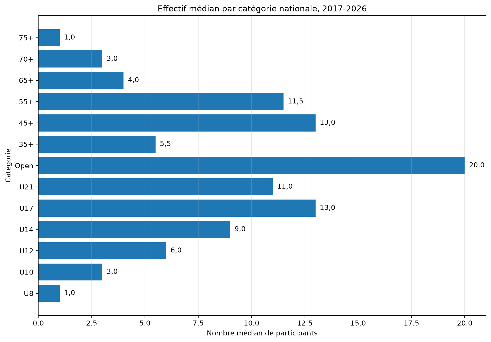
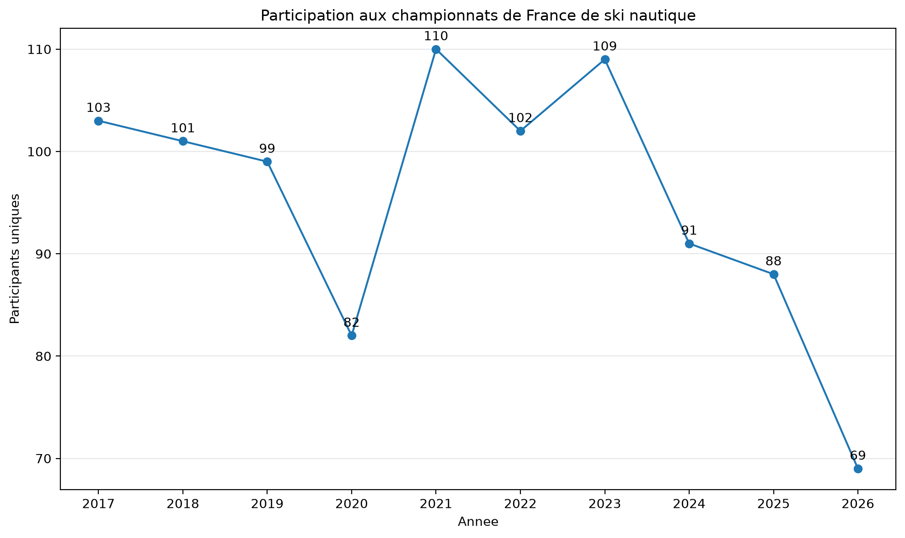
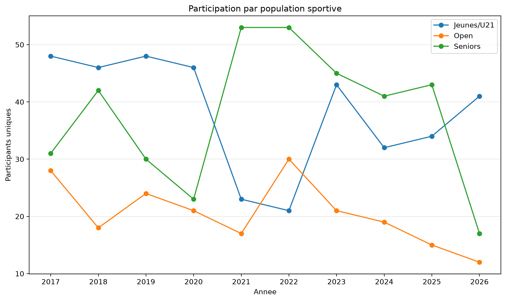
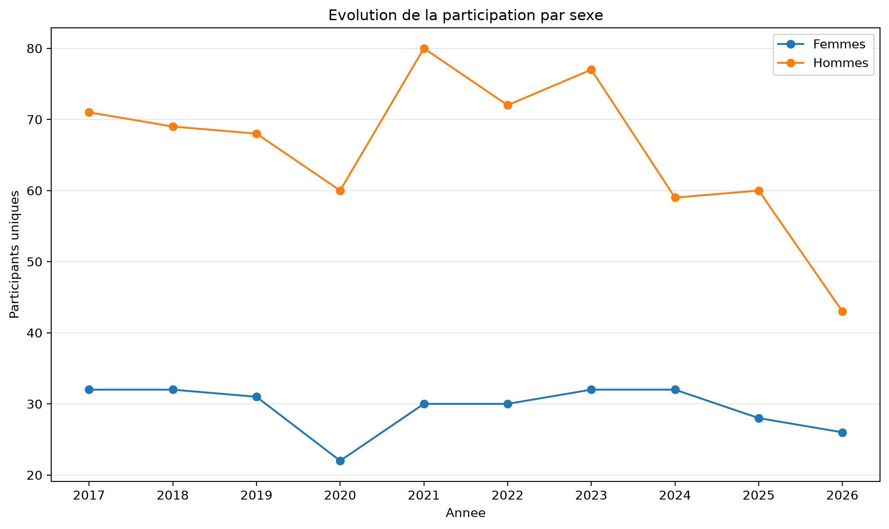
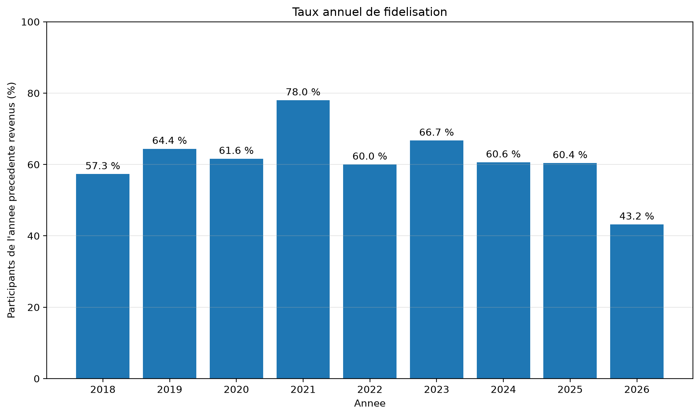
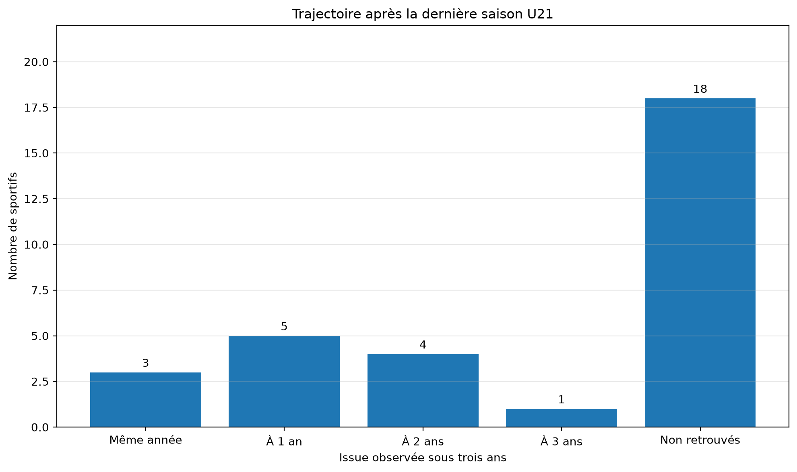
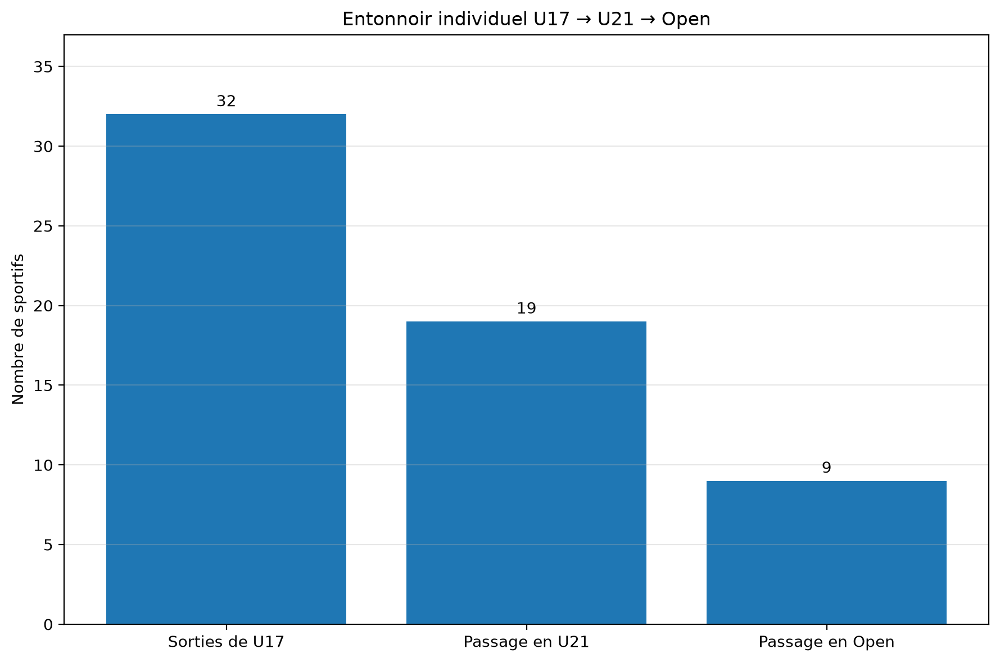
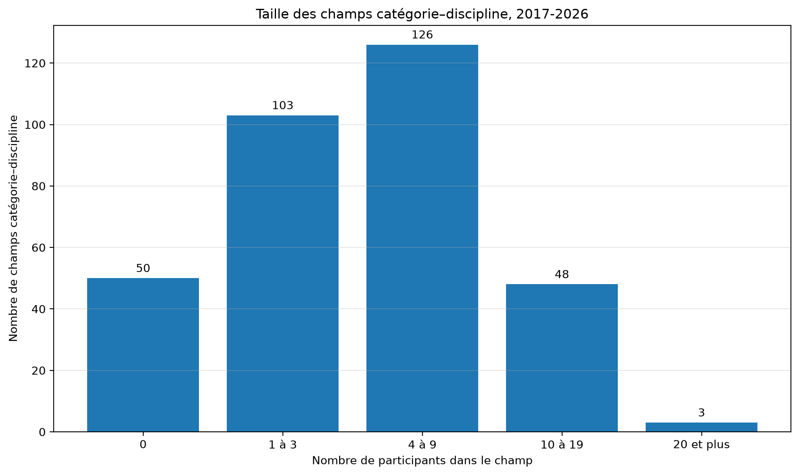

# Participation aux championnats de France de ski nautique

## Analyse longitudinale 2017-2026

*Note générée le 2026-07-21.*

## Périmètre et méthode

L’analyse porte sur 29 compétitions nationales organisées entre 2017 et 2026.

Les participants sont dénombrés comme des sportifs uniques par année, toutes compétitions nationales confondues.

La continuité des identités a été rétablie au moyen de 117 correspondances entre anciens et nouveaux identifiants.

<!-- BEGIN CONTEXTE EFFECTIFS -->
## Une population compétitive nationale très réduite

En 2026, les compétitions nationales étudiées rassemblent seulement **69 participants uniques**, toutes catégories confondues.

Ce chiffre ne représente pas l’ensemble des licenciés ou des pratiquants de ski nautique. Il mesure le vivier compétitif national effectivement présent aux Championnats de France.

La participation à ces championnats étant libre, sans sélection sportive préalable, les faibles effectifs observés ne peuvent pas être expliqués par un système de qualification, des quotas ou une limitation du nombre de participants.

Ils témoignent donc de la très faible profondeur de la pratique compétitive nationale observable.

### Effectifs nationaux observés en 2026

Les grandes populations comptent **41 Jeunes/U21**, **12 Open** et **17 Seniors**.

La somme de ces populations peut légèrement dépasser le nombre de participants uniques lorsqu’un même sportif apparaît dans plusieurs catégories au cours de la saison.

| Catégorie | Participants | Femmes | Hommes |
|---|---:|---:|---:|
| U8 | 1 | 0 | 1 |
| U10 | 6 | 4 | 2 |
| U12 | 9 | 3 | 6 |
| U14 | 6 | 2 | 4 |
| U17 | 12 | 6 | 6 |
| U21 | 9 | 2 | 7 |
| Open | 12 | 7 | 5 |
| 35+ | 3 | 3 | 0 |
| 45+ | 5 | 2 | 3 |
| 55+ | 4 | 0 | 4 |
| 65+ | 4 | 0 | 4 |
| 75+ | 1 | 0 | 1 |

### Conséquence sur l’interprétation des pourcentages

Dans la catégorie Open, qui ne compte que **12 participants en 2026**, une seule personne représente **8.3 %** de l’effectif.

Chez les Seniors, une personne représente **5.9 %** des 17 participants observés.

Le taux de passage U21 vers Open est de **13 sur 31**, soit **41.9 %**. Une seule transition supplémentaire ou en moins modifie ce taux de **3.2 points**.

Chez les femmes, le résultat repose sur seulement **5 passages sur 11 sportives**. Une seule personne représente alors **9.1 points de pourcentage**.

### Règle de présentation retenue

Les résultats doivent donc toujours être présentés sous la forme **effectif / population totale**, puis éventuellement en pourcentage.

Pour les groupes de moins de 30 personnes, les pourcentages sont considérés comme descriptifs et doivent être interprétés avec prudence.

Pour les groupes de moins de 10 personnes, aucun pourcentage ne doit être commenté indépendamment de l’effectif brut correspondant.
<!-- END CONTEXTE EFFECTIFS -->

<!-- BEGIN TAILLE STRUCTURELLE -->
## Des effectifs structurellement très faibles

La faiblesse des effectifs observée en 2026 n’est pas seulement conjoncturelle. Elle constitue une caractéristique durable de la pratique compétitive nationale.

Entre 2017 et 2026, la base contient **110 observations catégorie–année**.

Parmi elles, **63 sur 110**, soit **57.3 %**, réunissent moins de dix participants.

**102 sur 110**, soit **92.7 %**, réunissent moins de vingt participants.

**109 sur 110**, soit **99.1 %**, réunissent moins de trente participants.

Sur dix saisons, seules **1 observation catégorie–année sur 110** atteint donc au moins trente concurrents.

La catégorie Open, pourtant centrale dans la continuité sportive vers le plus haut niveau, présente un effectif médian de seulement **20 participants**. La médiane est de **11 en U21**, **13 en U17** et **9 en U14**.

### Effectifs par catégorie

| Catégorie | Années observées | Médiane | Minimum–maximum | Effectif 2026 | Poids d’une personne en 2026 |
|---|---:|---:|---:|---:|---:|
| U8 | 1 | 1,0 | 1–1 | 1 | 100,0 % |
| U10 | 10 | 3,0 | 1–8 | 6 | 16,7 % |
| U12 | 10 | 6,0 | 3–9 | 9 | 11,1 % |
| U14 | 10 | 9,0 | 5–13 | 6 | 16,7 % |
| U17 | 10 | 13,0 | 7–21 | 12 | 8,3 % |
| U21 | 9 | 11,0 | 1–15 | 9 | 11,1 % |
| Open | 10 | 20,0 | 12–30 | 12 | 8,3 % |
| 35+ | 10 | 5,5 | 3–10 | 3 | 33,3 % |
| 45+ | 10 | 13,0 | 5–19 | 5 | 20,0 % |
| 55+ | 10 | 11,5 | 4–23 | 4 | 25,0 % |
| 65+ | 10 | 4,0 | 2–11 | 4 | 25,0 % |
| 70+ | 5 | 3,0 | 1–4 | 0 | — |
| 75+ | 5 | 1,0 | 1–2 | 1 | 100,0 % |

### Portée de ce constat

Ces effectifs sont d’autant plus significatifs que la participation aux Championnats de France est libre, sans sélection sportive préalable.

Ils ne décrivent donc pas une élite volontairement restreinte par des qualifications ou des quotas. Ils révèlent la très faible profondeur du vivier compétitif national effectivement mobilisé.

Dans ces conditions, une variation d’une ou deux personnes peut modifier fortement les pourcentages d’une catégorie. Les effectifs bruts et les dénominateurs doivent toujours précéder l’interprétation des taux.
<!-- END TAILLE STRUCTURELLE -->

## Principaux résultats

La participation est de **103 sportifs en 2017**, atteint **109 en 2023**, puis recule à **69 en 2026**.

Entre 2023 et 2026, la diminution atteint **-40 participants**, soit **-36.7 %**.

### Évolution par population

| Population | 2023 | 2026 | Variation |
|---|---:|---:|---:|
| Jeunes/U21 | 43 | 41 | -2 (-4.7 %) |
| Open | 21 | 12 | -9 (-42.9 %) |
| Seniors | 45 | 17 | -28 (-62.2 %) |

La population **Jeunes/U21 reste globalement stable**. La contraction concerne principalement les catégories **Open** et **Seniors**.

La baisse senior représente 28 des 40 participants perdus entre 2023 et 2026.

### Évolution par sexe

Les femmes passent de **32 à 26 participantes**, soit -6.

Les hommes passent de **77 à 43 participants**, soit -34.

La diminution totale est donc principalement masculine : 34 des 40 participants perdus sont des hommes.

La part des femmes passe de **29.4 % en 2023** à **37.7 % en 2026**, sans hausse de leur effectif.

### Fidélisation

Le taux global de fidélisation tombe à **43.2 % en 2026**.

Chez les Seniors, seuls **8 des 43 participants de 2025** sont présents en 2026.

## Figures

### Participation totale

### Participation par population

### Participation par sexe

### Taux de fidélisation

<!-- BEGIN TRANSITION U21 OPEN -->
## Transition de la catégorie U21 vers l’Open

L’analyse porte sur les sportifs dont la dernière participation observée en U21 se situe entre 2017 et 2023. Cette borne permet de disposer de trois années complètes de recul.

Sur **31 sorties observées de U21**, **13 sportifs apparaissent ensuite en Open dans un délai maximal de trois ans**, soit **41.9 %**.

À l’inverse, **18 sportifs**, soit **58.1 %**, ne sont plus retrouvés dans les championnats nationaux étudiés sur cette période.

Cette absence ne signifie pas nécessairement un arrêt complet de la pratique ; elle indique une sortie du périmètre compétitif national observé.

### Délai du passage vers l’Open

| Délai | Sportifs |
|---|---:|
| Même année | 3 |
| Un an | 5 |
| Deux ans | 4 |
| Trois ans | 1 |
| Non retrouvés | 18 |

Chez les femmes, **5 sur 11** passent en Open, soit **45.5 %**.

Chez les hommes, **8 sur 20** passent en Open, soit **40.0 %**.

La transition entre U21 et Open constitue ainsi un point de fragilité majeur de la continuité compétitive nationale.
<!-- END TRANSITION U21 OPEN -->
<!-- BEGIN ENTONNOIR U17 U21 OPEN -->
## Un entonnoir compétitif extrêmement étroit

Pour suivre une même population sur l’ensemble du parcours, l’analyse retient les **32 sportifs dont la dernière saison observée en U17 se situe entre 2017 et 2020**.

Parmi ces **32 sportifs**, seuls **19 sont ensuite retrouvés en U21** dans un délai maximal de trois ans.

Parmi la cohorte initiale, seuls **9 sportifs sont finalement retrouvés en Open après leur passage en U21**.

| Étape observée | Sportifs |
|---|---:|
| Dernière saison U17 | 32 |
| Passage en U21 | 19 |
| Passage en Open après U21 | 9 |

Le parcours complet U17 → U21 → Open concerne donc **9 sportifs sur 32**.

Une seule personne représente ici **3.1 points de pourcentage**. Le pourcentage correspondant ne doit donc jamais être présenté sans les effectifs bruts.

### Lecture par sexe

Chez les femmes, la cohorte ne comprend que **12 sportives** : **6 atteignent U21** et **3 atteignent ensuite Open**.

Chez les hommes, la cohorte comprend **20 sportifs** : **13 atteignent U21** et **6 atteignent ensuite Open**.

Ces nombres sont trop faibles pour conclure à une différence statistiquement robuste entre les sexes.

### Portée institutionnelle

Cet entonnoir doit être rapproché de la taille déjà très faible des catégories nationales. L’Open ne réunit qu’un effectif médian de vingt participants sur la période 2017-2026.

La participation aux Championnats de France étant libre, sans sélection préalable, ces faibles nombres ne correspondent pas à une élite restreinte par des quotas. Ils révèlent l’étroitesse réelle du vivier compétitif national et sa difficulté à conserver les sportifs au fil des catégories.
<!-- END ENTONNOIR U17 U21 OPEN -->
<!-- BEGIN PROFONDEUR EPREUVES -->
## Des épreuves nationales souvent réduites à quelques concurrents

Le nombre total de participants masque une fragmentation supplémentaire entre les catégories et les trois disciplines : slalom, figures et saut.

Un « champ catégorie–discipline » correspond ici à une catégorie nationale observée une année, croisée avec chacune des trois disciplines.

Entre 2017 et 2026, **330 champs potentiels** sont ainsi observés.

**50 champs sur 330** ne comptent aucun participant dans la discipline considérée.

**103 champs** ne réunissent que **un à trois participants**.

En incluant les champs vides, **153 champs sur 330**, soit **46.4 %**, comptent au maximum trois participants.

Parmi les **280 champs effectivement disputés**, **103**, soit **36.8 %**, ne dépassent pas trois concurrents.

**279 champs sur 330**, soit **84.5 %**, comptent moins de dix participants.

**327 champs sur 330**, soit **99.1 %**, comptent moins de vingt participants.

Seuls **3 champs sur 330** atteignent vingt participants ou davantage.

### Profondeur médiane par discipline

| Discipline | Champs | Champs vides | Médiane tous champs | Médiane champs disputés | Maximum |
|---|---:|---:|---:|---:|---:|
| Slalom | 110 | 7 | 6.0 | 8.0 | 27 |
| Figures | 110 | 11 | 4.0 | 4.0 | 15 |
| Saut | 110 | 32 | 3.0 | 4.0 | 14 |

Parmi les champs effectivement disputés, l’effectif médian est de **8 participants en slalom**, mais seulement de **4 en figures** et de **4 en saut**.

### Situation observée en 2026

| Catégorie | Slalom | Figures | Saut |
|---|---:|---:|---:|
| U8 | 0 | 1 | 0 |
| U10 | 5 | 4 | 1 |
| U12 | 9 | 8 | 5 |
| U14 | 6 | 2 | 2 |
| U17 | 11 | 8 | 6 |
| U21 | 7 | 6 | 4 |
| Open | 10 | 6 | 4 |
| 35+ | 3 | 0 | 0 |
| 45+ | 3 | 0 | 0 |
| 55+ | 3 | 1 | 0 |
| 65+ | 3 | 0 | 0 |
| 75+ | 1 | 1 | 0 |

La catégorie Open ne réunit en 2026 que **10 concurrents en slalom**, **6 en figures** et **4 en saut**.

Une seule personne représente donc **10.0 %** du champ Open en slalom, **16.7 %** en figures et **25.0 %** en saut.

### Interprétation

Ces résultats montrent que la faiblesse du vivier national ne tient pas seulement au nombre global de participants. Elle est accentuée par la fragmentation des sportifs entre de nombreuses catégories et plusieurs disciplines.

Dans de nombreux champs, le nombre de concurrents est égal ou inférieur au nombre de places sur un podium.

La participation aux Championnats de France étant libre, sans sélection préalable, cette situation révèle une profondeur compétitive nationale extrêmement limitée.
<!-- END PROFONDEUR EPREUVES -->
## Conclusion provisoire

Les données ne montrent pas un effondrement général de la filière jeunes. Elles mettent en évidence une difficulté croissante à maintenir une participation durable dans les catégories Open et Seniors.

L’étape suivante consistera à étudier les trajectoires individuelles entre les catégories Jeunes/U21, Open et Seniors.
