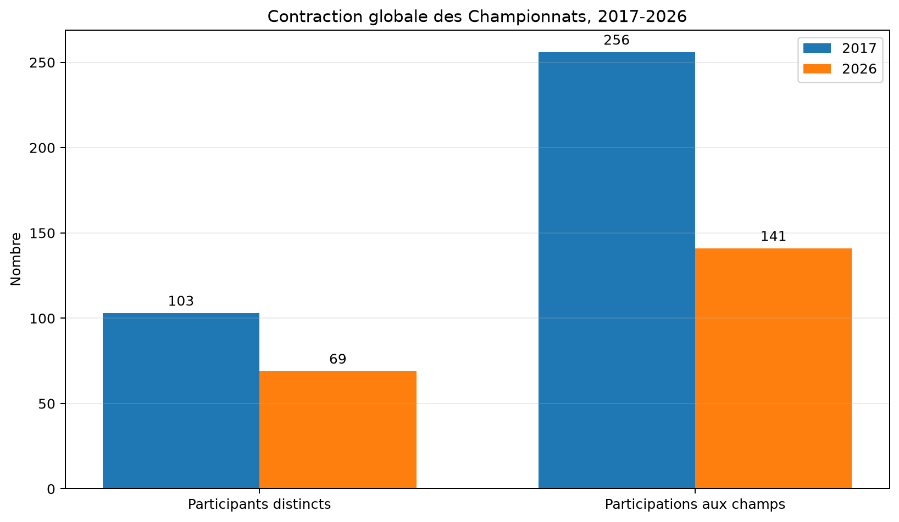
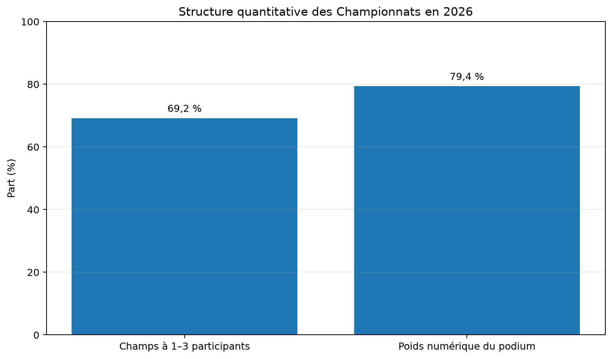
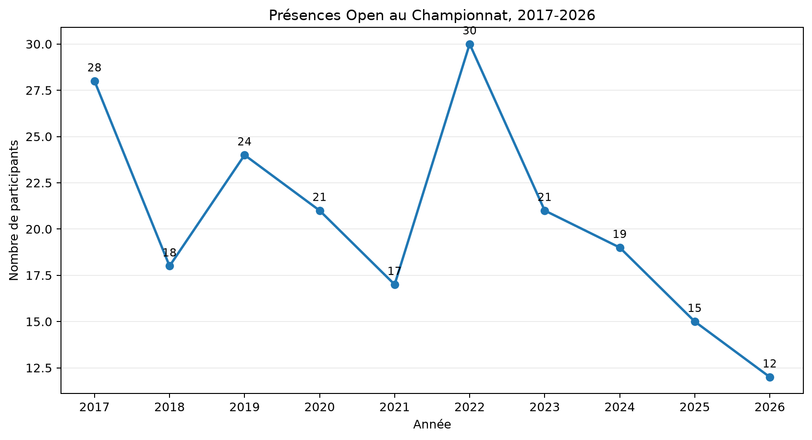
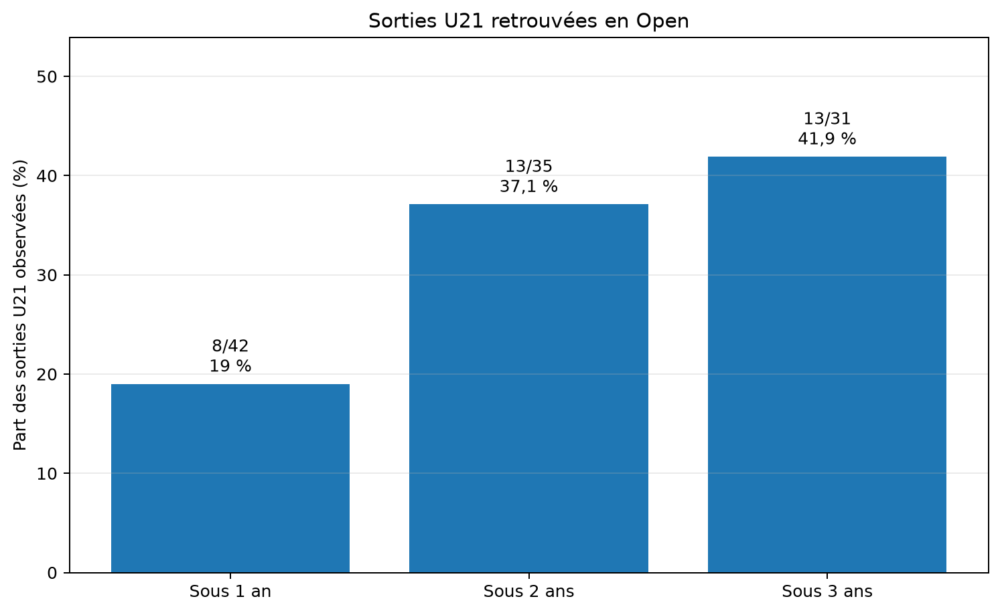
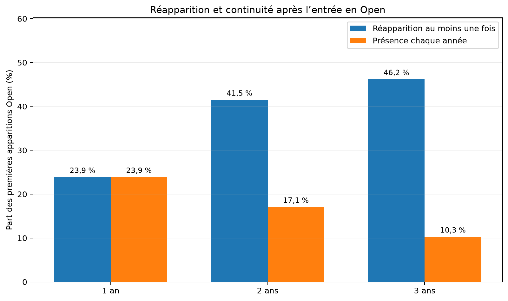
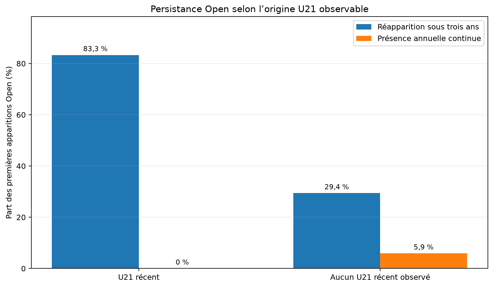
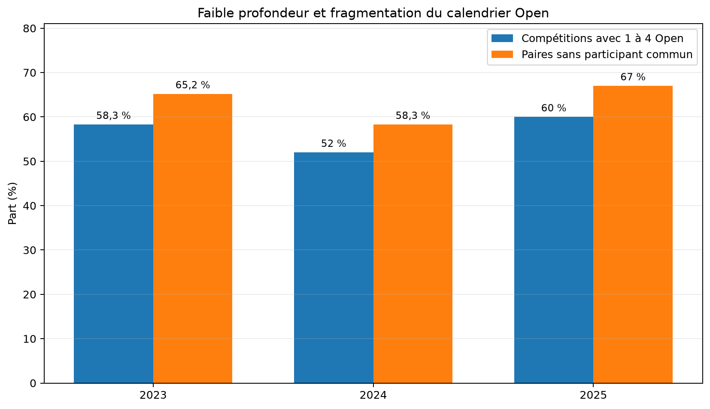
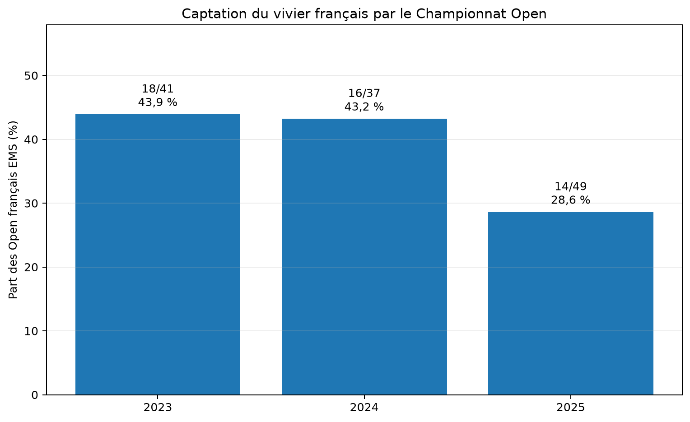

# Championnats de France de ski nautique classique : rapport décennal principal 2017-2026

> Version 5 — synthèse intégrée du rapport longitudinal global et de l’analyse de la filière U21 → Open.

## Résumé exécutif

Entre 2017 et 2026, le nombre de participants distincts enregistrés aux Championnats passe de **103 à 69**, soit **-33 %**. Dans le même temps, les participations aux champs diminuent de **256 à 141**, soit **-44,9 %**.

En 2026, **36 des 52 champs effectivement disputés**, soit **69,2 %**, ne réunissent que un à trois participants. Le poids numérique théorique du podium atteint **79,4 %**.

La catégorie Open, centrale dans la trajectoire compétitive, passe de **28 participants au Championnat en 2017 à 12 en 2026**, soit **-57,1 %**. Parmi les sorties U21 disposant de trois années de recul, **13 sur 31** sont retrouvées en Open. Après une première apparition Open, seulement **4 sur 39** restent présents chaque année pendant les trois années suivantes.

**Conclusion centrale.** La difficulté principale ne réside pas dans l’absence d’épreuves, mais dans la réduction du vivier, la faible profondeur des champs, la conversion incomplète vers Open et la rareté d’une présence annuelle durable dans la catégorie centrale.

## 1. Objet du rapport

Le rapport global v4 établissait la contraction générale de la participation et la multiplication des champs à très faible effectif. La présente version conserve ce cadrage, mais déplace le centre de l’analyse vers la trajectoire compétitive : **Relève/U17 → U21 → Open → Senior**.

La santé de la filière n’est donc pas appréciée uniquement au nombre total de compétiteurs toutes catégories confondues. Elle est examinée à travers sa capacité à renouveler, alimenter et pérenniser la catégorie Open. Les Seniors renseignent la continuité ou l’héritage de la pratique ; ils ne peuvent pas, seuls, servir d’indicateur de développement ou d’accès au haut niveau.

## 2. Méthode et périmètres

L’analyse combine les codes nationaux explicitement validés des Championnats de France, les inscriptions approuvées dans l’EMS et les résultats classés. Ces sources décrivent des objets différents et ne sont jamais fusionnées sans contrôle de périmètre.

La grille de **104 champs** utilisée dans le rapport global constitue une grille analytique de référence. Elle ne doit pas être présentée comme le programme réglementaire effectivement disputé chaque année.

Le **poids numérique théorique du podium** rapporte le nombre maximal de places de podium attribuables dans les champs effectivement disputés au nombre total de participations classées. Il mesure la sélectivité quantitative des champs ; il ne mesure pas la valeur sportive des médailles.

L’année 2020 constitue une rupture statistique dans un contexte sanitaire exceptionnel. Les données permettent d’en constater l’existence, mais pas d’attribuer mécaniquement l’ensemble des évolutions ultérieures à cette seule cause.

<!-- PAGEBREAK -->

## 3. Une contraction globale et une sélectivité quantitative affaiblie

*Source : rapport longitudinal global v4. Les deux indicateurs mesurent respectivement les personnes distinctes et les présences dans les champs de classement.*

La baisse des participations aux champs est plus forte que celle des participants distincts. Cette divergence est compatible avec une réduction de la multidisciplinarité ou du nombre de participations par sportif, sans permettre d’en établir seule la cause.

La valeur sportive d’une médaille ne peut pas être réduite à son poids numérique. Les données établissent toutefois un **affaiblissement de la sélectivité quantitative** : dans une part croissante des champs, l’accès au podium dépend d’un nombre très faible de concurrents.

## 4. Open devient le point critique de la filière

Le nombre de participants au Championnat Open passe de **28 à 12**. La hausse observée en 2022 ne renverse pas la contraction enregistrée depuis 2023.

Cette série historique comprend toutes les nationalités présentes dans les codes Open. Elle ne doit pas être confondue avec le vivier français EMS utilisé pour l’analyse du calendrier à partir de 2023.

<!-- PAGEBREAK -->

## 5. Le passage U21 → Open reste minoritaire à trois ans

Les taux observés sont de **19 % sous un an**, **37,1 % sous deux ans** et **41,9 % sous trois ans**. Les dénominateurs diminuent avec l’horizon, car seules les cohortes disposant d’un recul suffisant sont conservées.

À trois ans, **18 sorties U21 sur 31** ne sont pas retrouvées en Open au Championnat dans la fenêtre observable. Cela ne signifie pas qu’elles ont cessé toute pratique sportive.

<!-- PAGEBREAK -->

## 6. L’entrée en Open débouche rarement sur une présence continue

Sous trois ans, **18 sur 39**, soit **46,2 %**, réapparaissent au moins une fois. Mais seulement **4 sur 39**, soit **10,3 %**, sont présents chaque année sans interruption.

Le principal enjeu n’est donc pas uniquement l’accès ponctuel à Open, mais l’intégration durable dans la catégorie.

<!-- PAGEBREAK -->

## 7. Un parcours U21 récent est associé à davantage de réapparitions

Parmi les premières apparitions Open précédées d’un parcours U21 récent, **5 sur 6** réapparaissent sous trois ans, contre **5 sur 17** lorsqu’aucun U21 récent n’est observé.

L’effectif du groupe U21 récent n’est que de six sportifs. Le résultat décrit une association forte, mais ne permet pas d’établir une causalité.

## 8. Un calendrier abondant, mais dispersé sur un vivier réduit

| Année | Compétitions avec Open | Open français distincts | Champs à 1–4 Open | Paires sans participant commun |
|---:|---:|---:|---:|---:|
| 2023 | 24 | 41 | 14/24 (58,3 %) | 180/276 (65,2 %) |
| 2024 | 25 | 37 | 13/25 (52 %) | 175/300 (58,3 %) |
| 2025 | 25 | 49 | 15/25 (60 %) | 201/300 (67 %) |

Le calendrier n’est pas constitué de circuits entièrement étanches : une grande composante relie l’essentiel des épreuves à travers un petit noyau de compétiteurs multi-épreuves. Il apparaît toutefois davantage comme un réseau faiblement connecté offrant de nombreuses occasions de performances homologuées à une population restreinte que comme un dispositif élargissant durablement la base Open.

<!-- PAGEBREAK -->

## 9. Le Championnat Open rassemble une part décroissante du vivier français

La captation du vivier français EMS est de **43,9 % en 2023**, **43,2 % en 2024** et **28,6 % en 2025**.

L’augmentation du nombre d’Open français actifs en 2025 ne se traduit donc pas par un renforcement de l’épreuve nationale centrale. Comme le Championnat Open ne repose pas sur une qualification nationale préalable, cette faible captation interroge directement la capacité fédératrice et l’attractivité compétitive du dispositif.

## 10. Senior : une population d’aval qui ne compense pas la faiblesse d’Open

Parmi les anciens Open disposant d’au moins une saison observable, **5 sur 24**, soit **20,8 %**, sont retrouvés ultérieurement en Senior. **8 sportifs** sont observés simultanément en Open et Senior une même saison.

La population Senior peut témoigner d’une continuité ou d’une reprise de la pratique. Les données ne permettent pas de caractériser les ressources économiques des participants ni les conditions ayant rendu cette continuité possible. Elle ne peut pas masquer un faible renouvellement U21, une catégorie Open réduite ou une faible présence annuelle continue.

## 11. Ce que les données permettent d’affirmer

- La participation aux Championnats se contracte fortement sur la décennie.
- La profondeur des champs diminue et le poids numérique du podium augmente.
- Moins de la moitié des sorties U21 observables sont retrouvées en Open sous trois ans.
- Une première apparition Open conduit plus souvent à une réapparition intermittente qu’à une présence annuelle continue.
- Le calendrier est abondant au regard du faible nombre d’Open concernés.
- Le Championnat Open capte une part minoritaire et décroissante du vivier français EMS.
- Senior renseigne l’aval de la pratique, mais pas la capacité de renouvellement de la catégorie reine.

## 12. Ce que les données ne permettent pas d’affirmer seules

- Elles n’établissent pas les causes individuelles de l’absence ou de l’arrêt.
- Elles ne démontrent pas une désertion sociale ou économique sans données complémentaires.
- Elles ne permettent pas d’attribuer mécaniquement les évolutions à 2020.
- Elles ne prouvent pas que la fréquence de compétition cause la fidélisation.
- Elles ne permettent pas de réduire la valeur sportive d’une médaille à la seule taille du champ.

## 13. Tableau de bord annuel recommandé

| Indicateur | Définition | Fonction |
|---|---|---|
| Conversion U21 → Open à 1, 2 et 3 ans | Part des dernières présences U21 retrouvées en Open | Mesurer l’alimentation de la catégorie centrale |
| Continuité Open à 1, 2 et 3 ans | Présence Open chaque année sans interruption | Mesurer l’intégration durable |
| Captation du Championnat Open | Open français du code précis / vivier Open français EMS | Mesurer la capacité fédératrice de l’épreuve nationale |
| Profondeur des champs | Distribution des champs par taille | Mesurer la sélectivité quantitative |
| Concentration du calendrier | Part des participations portée par le noyau le plus actif | Identifier la dépendance à un petit groupe |
| Passage Open → Senior | Anciens Open retrouvés en Senior | Décrire la continuité aval sans la confondre avec le développement |

## 14. Conclusion générale

Le diagnostic décennal ne décrit pas simplement une baisse de participation. Il met en évidence une architecture compétitive dont la catégorie centrale se contracte, dont l’alimentation par U21 reste partielle et dont la présence annuelle continue est rare.

Le calendrier français propose de nombreuses occasions de produire des performances homologuées, mais cette abondance ne suffit pas à démontrer l’existence d’une filière capable d’élargir et de stabiliser durablement le vivier Open. L’enjeu institutionnel devient donc moins la multiplication des épreuves que la définition d’une trajectoire mesurable : entrée en Open, accompagnement, fidélisation et rôle fédérateur du Championnat de France.

## Limites

- Les données EMS décrivent des inscriptions approuvées, pas nécessairement des départs ou des classements.
- Les périmètres de nationalité et de statut diffèrent entre certaines séries historiques et l’EMS.
- Le bloc U21/Open 2025 est incomplet dans les résultats classés ; les analyses centrales 2025 reposent donc sur l’EMS lorsque nécessaire.
- Une absence au Championnat de France ne signifie pas un arrêt de toute pratique compétitive.
- Les associations observées ne démontrent pas de causalité.
