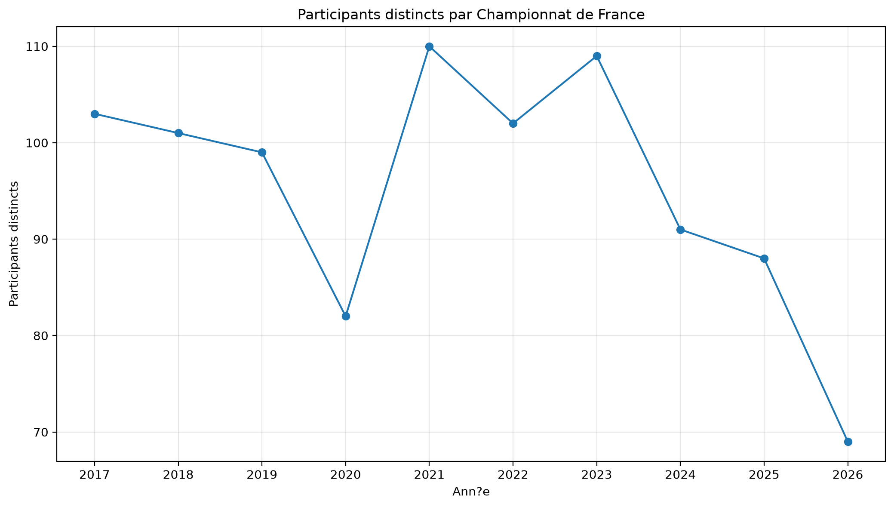
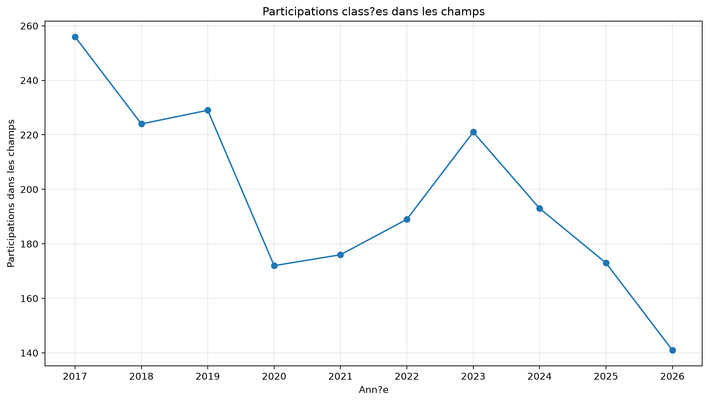
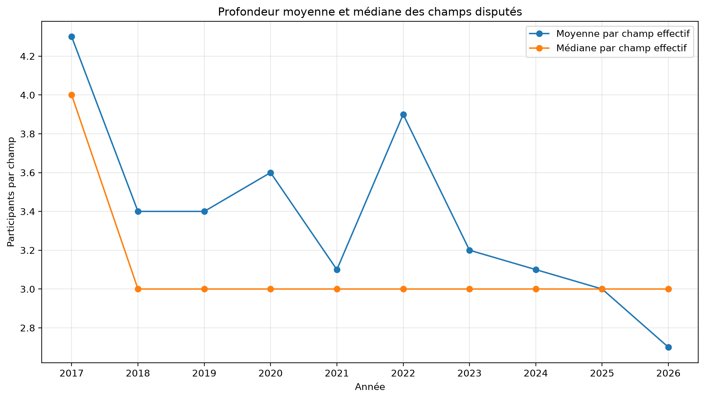
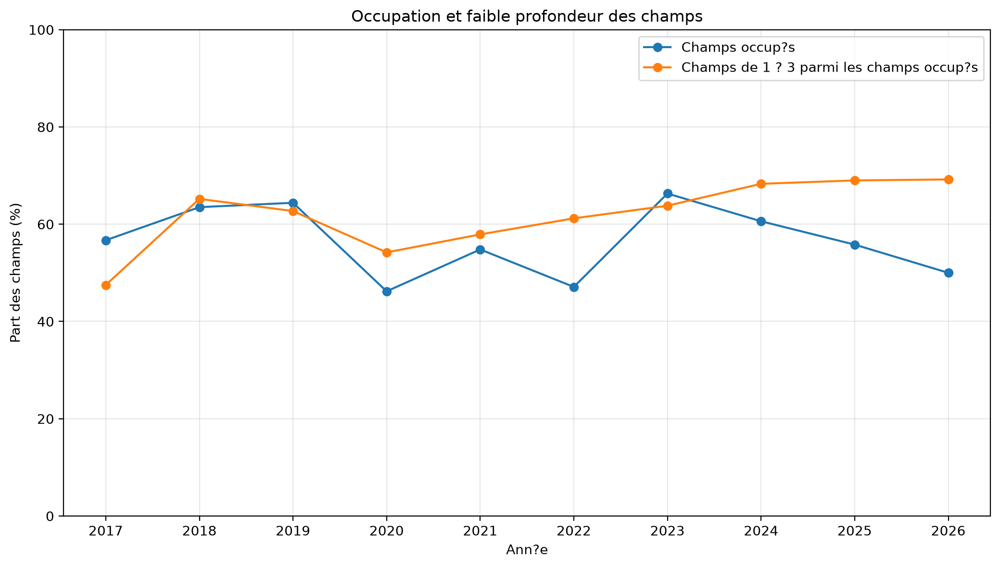
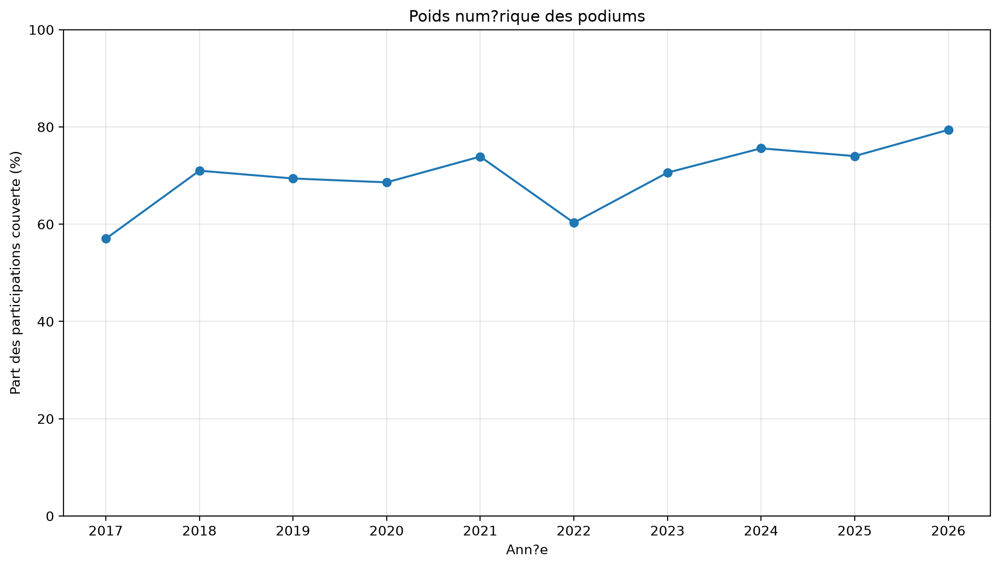
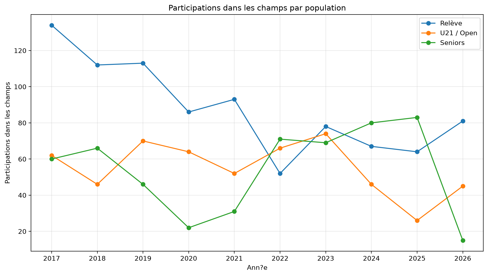
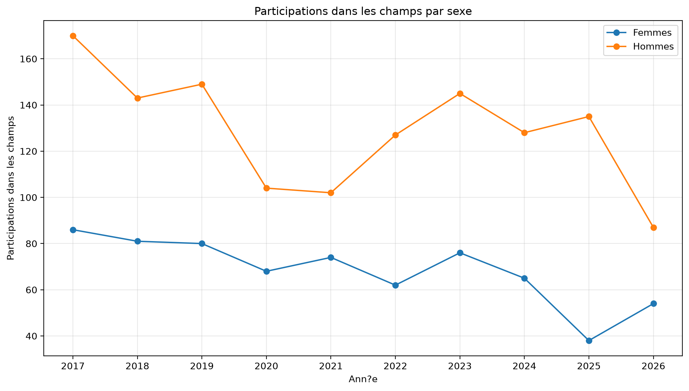
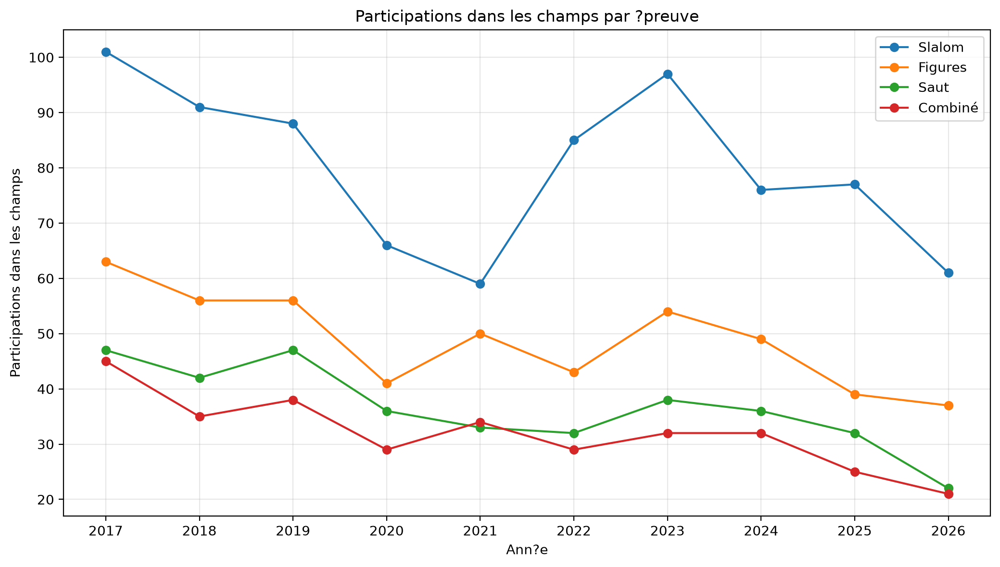

# Évolution de la participation et de la profondeur des champs

## Championnats de France de ski nautique classique — 2017-2026

**Rapport longitudinal comparatif — version 2**

## 1. Objet du rapport

Ce rapport analyse séparément chacun des Championnats de France de ski nautique classique organisés entre 2017 et 2026, puis confronte les dix diagnostics annuels.

L’objectif n’est pas d’additionner les dix années dans une population statistique unique, mais d’observer l’évolution du système compétitif : contractions, rebonds, ruptures et transformations de la profondeur des champs.

L’unité de comparaison reste le Championnat de France annuel.

## 2. Méthode

### 2.1 Participants distincts

Le nombre de **participants distincts** correspond au nombre de personnes différentes recensées au cours d’un championnat.

Un même sportif n’est compté qu’une fois dans cet indicateur, même s’il participe dans plusieurs catégories et plusieurs épreuves.

### 2.2 Participations dans les champs

Les **participations dans les champs** correspondent à la somme des sportifs observés dans chaque champ (= catégorie × sexe × épreuve). Une même personne peut donc être comptée dans plusieurs champs.

Cet indicateur repose sur les résultats classés par épreuve. Un sportif recensé dans le championnat sans résultat classé dans une épreuve contribue au nombre de participants distincts, mais pas nécessairement aux participations dans les champs.

### 2.3 Grille annuelle de référence

Une grille analytique identique est appliquée à chaque année : 13 catégories × 2 sexes × 4 épreuves, soit **104 champs de référence par année**.

Cette grille standardisée est un outil de comparaison. Elle ne signifie pas que chacun des 104 champs figurait nécessairement au programme réglementaire de chaque édition.

Un champ sans résultat classé conserve un effectif nul. Le dénominateur constant permet de confronter directement les années.

### 2.4 Indicateurs de profondeur

La profondeur annuelle est appréciée à partir du nombre de champs effectifs, de l’effectif moyen et médian par champ, de la proportion de champs comptant de 1 à 3 participants et de l’effectif maximal observé.

### 2.5 Poids numérique des podiums

Pour une année `a`, la part des participations couverte par les podiums est calculée ainsi :

`P_a = [Σ_i min(3, n_(a,i)) / Σ_i n_(a,i)] × 100`

Dans cette formule, `n_(a,i)` représente l’effectif du champ `i` pendant l’année `a`.

Le calcul est pondéré par les participations : un champ de dix participants pèse davantage qu’un champ d’un participant.

Cet indicateur ne mesure ni la valeur sportive d’une médaille ni la probabilité individuelle d’en obtenir une.

## 3. Diagnostic annuel global

| Année | Participants distincts | F | H | Champs effectifs | Occupation | Participations dans les champs | Moyenne/champ | Médiane | Champs de 1 à 3 | Part de 1 à 3 | Maximum | Podiums |
|---:|---:|---:|---:|---:|---:|---:|---:|---:|---:|---:|---:|---:|
| 2017 | 103 | 32 | 71 | 59 / 104 | 56,7 % | 256 | 4,3 | 4,0 | 28 | 47,5 % | 15 | 57,0 % |
| 2018 | 101 | 32 | 69 | 66 / 104 | 63,5 % | 224 | 3,4 | 3,0 | 43 | 65,2 % | 17 | 71,0 % |
| 2019 | 99 | 31 | 68 | 67 / 104 | 64,4 % | 229 | 3,4 | 3,0 | 42 | 62,7 % | 13 | 69,4 % |
| 2020 | 82 | 22 | 60 | 48 / 104 | 46,2 % | 172 | 3,6 | 3,0 | 26 | 54,2 % | 9 | 68,6 % |
| 2021 | 110 | 30 | 80 | 57 / 104 | 54,8 % | 176 | 3,1 | 3,0 | 33 | 57,9 % | 8 | 73,9 % |
| 2022 | 102 | 30 | 72 | 49 / 104 | 47,1 % | 189 | 3,9 | 3,0 | 30 | 61,2 % | 18 | 60,3 % |
| 2023 | 109 | 32 | 77 | 69 / 104 | 66,3 % | 221 | 3,2 | 3,0 | 44 | 63,8 % | 10 | 70,6 % |
| 2024 | 91 | 32 | 59 | 63 / 104 | 60,6 % | 193 | 3,1 | 3,0 | 43 | 68,3 % | 10 | 75,6 % |
| 2025 | 88 | 28 | 60 | 58 / 104 | 55,8 % | 173 | 3,0 | 3,0 | 40 | 69,0 % | 11 | 74,0 % |
| 2026 | 69 | 26 | 43 | 52 / 104 | 50,0 % | 141 | 2,7 | 3,0 | 36 | 69,2 % | 7 | 79,4 % |

Entre 2017 et 2026, les participants distincts passent de **103 à 69**, soit **34 personnes de moins** et une évolution de **-33,0 %**.

Les participations dans les champs passent de **256 à 141**, soit **115 de moins** et une évolution de **-44,9 %**.

Cette comparaison entre les extrémités ne suffit pas à décrire l’évolution. La série fait apparaître plusieurs séquences distinctes.

## 4. Périodisation de l’évolution

### 4.1 De 2017 à 2019 : stabilité des effectifs, amincissement des champs

Les participants distincts demeurent relativement stables : **103 en 2017, 101 en 2018 et 99 en 2019**.

Les participations dans les champs passent toutefois de **256 à 224 puis 229**. La médiane diminue de **4 à 3**, tandis que le poids des podiums passe de **57,0 %** à **71,0 %**, puis **69,4 %**.

La fragilisation de la profondeur apparaît donc avant la contraction récente du nombre de participants.

### 4.2 L’année 2020 : contraction générale

En 2020, le championnat réunit **82 participants distincts**, **48 champs effectifs** et **172 participations dans les champs**.

Cette édition constitue une rupture statistique. Le rapport décrit cette rupture sans lui attribuer de cause.

### 4.3 Les années 2021 et 2022 : deux configurations atypiques

En 2021, le nombre de participants distincts atteint le maximum de la période avec **110 personnes**, mais les participations dans les champs restent limitées à **176**, réparties dans **57 champs effectifs**.

En 2022, seulement **49 champs** sont effectifs, mais ils réunissent **189 participations** et l’un d’eux atteint **18 participants**. Le poids des podiums revient à **60,3 %**.

Les deux éditions présentent donc des structures très différentes.

### 4.4 L’année 2023 : élargissement sans retour à la profondeur de 2017

En 2023, le nombre de champs effectifs atteint son maximum avec **69 champs sur 104**, et le championnat réunit **109 participants distincts**.

Cependant, **44 champs sur 69**, soit **63,8 %**, ne comptent que 1 à 3 participants. L’effectif moyen est de **3,2 par champ**, contre **4,3 en 2017**.

L’architecture compétitive s’élargit donc sans retrouver la profondeur du début de période.

### 4.5 De 2024 à 2026 : contraction sur trois éditions successives

| Année | Participants distincts | Participations dans les champs | Champs effectifs | Champs de 1 à 3 | Podiums |
|---:|---:|---:|---:|---:|---:|
| 2023 | 109 | 221 | 69 / 104 | 44 / 69 | 70,6 % |
| 2024 | 91 | 193 | 63 / 104 | 43 / 63 | 75,6 % |
| 2025 | 88 | 173 | 58 / 104 | 40 / 58 | 74,0 % |
| 2026 | 69 | 141 | 52 / 104 | 36 / 52 | 79,4 % |

Entre 2023 et 2026, les participants distincts passent de **109 à 69**, les participations dans les champs de **221 à 141** et les champs effectifs de **69 à 52**.

Cette succession constitue la contraction récente la plus lisible de la période.

## 5. Comparaison par population

| Année | Relève : participations | Relève : champs | U21/Open : participations | U21/Open : champs | Seniors : participations | Seniors : champs |
|---:|---:|---:|---:|---:|---:|---:|
| 2017 | 134 | 28 / 40 | 62 | 8 / 16 | 60 | 23 / 48 |
| 2018 | 112 | 31 / 40 | 46 | 16 / 16 | 66 | 19 / 48 |
| 2019 | 113 | 32 / 40 | 70 | 16 / 16 | 46 | 19 / 48 |
| 2020 | 86 | 23 / 40 | 64 | 16 / 16 | 22 | 9 / 48 |
| 2021 | 93 | 30 / 40 | 52 | 14 / 16 | 31 | 13 / 48 |
| 2022 | 52 | 17 / 40 | 66 | 8 / 16 | 71 | 24 / 48 |
| 2023 | 78 | 27 / 40 | 74 | 16 / 16 | 69 | 26 / 48 |
| 2024 | 67 | 22 / 40 | 46 | 16 / 16 | 80 | 25 / 48 |
| 2025 | 64 | 26 / 40 | 26 | 7 / 16 | 83 | 25 / 48 |
| 2026 | 81 | 31 / 40 | 45 | 13 / 16 | 15 | 8 / 48 |

### 5.1 Relève : maintien des champs, amincissement de leur profondeur

La Relève compte **28 champs effectifs et 134 participations en 2017**, contre **31 champs et 81 participations en 2026**.

L’effectif moyen passe de **4,8 à 2,6 participants par champ effectif**.

La part des champs de 1 à 3 participants passe parallèlement de **32,1 % à 71,0 %**.

### 5.2 U21 / Open : une structure très volatile

En 2018, l’ensemble U21/Open compte **46 participations réparties dans les 16 champs de référence**, avec une médiane de **2,5** et un poids des podiums de **80,4 %**.

En 2022, il compte **66 participations dans seulement 8 champs**, avec une médiane de **7,5**, un maximum de **18 participants** et un poids des podiums de **36,4 %**.

Des volumes proches peuvent donc correspondre à des structures compétitives très différentes.

### 5.3 Seniors : une rupture propre à 2026

Les Seniors passent de **83 participations dans 25 champs en 2025** à **15 participations dans 8 champs en 2026**.

Tous les champs Seniors disputés en 2026 comptent de 1 à 3 participants. Cette situation ne doit pas être présentée comme l’aboutissement d’une baisse continue sur dix ans.

## 6. Comparaison par sexe

Les données de cette section sont des participations dans les champs et non des personnes distinctes.

| Année | Femmes : participations | Femmes : champs | Femmes : médiane | Femmes : podiums | Hommes : participations | Hommes : champs | Hommes : médiane | Hommes : podiums |
|---:|---:|---:|---:|---:|---:|---:|---:|---:|
| 2017 | 86 | 25 / 52 | 3,0 | 62,8 % | 170 | 34 / 52 | 5,0 | 54,1 % |
| 2018 | 81 | 28 / 52 | 3,0 | 81,5 % | 143 | 38 / 52 | 3,0 | 65,0 % |
| 2019 | 80 | 30 / 52 | 2,5 | 83,8 % | 149 | 37 / 52 | 4,0 | 61,7 % |
| 2020 | 68 | 21 / 52 | 3,0 | 76,5 % | 104 | 27 / 52 | 3,0 | 63,5 % |
| 2021 | 74 | 26 / 52 | 3,0 | 79,7 % | 102 | 31 / 52 | 3,0 | 69,6 % |
| 2022 | 62 | 20 / 52 | 3,0 | 74,2 % | 127 | 29 / 52 | 3,0 | 53,5 % |
| 2023 | 76 | 29 / 52 | 3,0 | 80,3 % | 145 | 40 / 52 | 3,0 | 65,5 % |
| 2024 | 65 | 23 / 52 | 3,0 | 83,1 % | 128 | 40 / 52 | 3,0 | 71,9 % |
| 2025 | 38 | 23 / 52 | 1,0 | 97,4 % | 135 | 35 / 52 | 3,0 | 67,4 % |
| 2026 | 54 | 21 / 52 | 3,0 | 87,0 % | 87 | 31 / 52 | 3,0 | 74,7 % |

Les champs féminins sont, sur la plupart des éditions, moins nombreux et moins profonds que les champs masculins.

L’année 2025 est particulièrement fragile : **38 participations féminines**, **23 champs effectifs**, une médiane de **1 participante** et un poids des podiums de **97,4 %**.

En 2026, les participations féminines remontent à **54**, mais le poids des podiums reste élevé, à **87,0 %**.

## 7. Comparaison par épreuve

| Épreuve | Participations 2017 | Participations 2026 | Évolution | Médiane 2017 | Médiane 2026 | Podiums 2017 | Podiums 2026 |
|---|---:|---:|---:|---:|---:|---:|---:|
| Slalom | 101 | 61 | -40 (-39,6 %) | 6,0 | 3,0 | 41,6 % | 72,1 % |
| Figures | 63 | 37 | -26 (-41,3 %) | 3,5 | 1,0 | 63,5 % | 78,4 % |
| Saut | 47 | 22 | -25 (-53,2 %) | 3,0 | 2,0 | 68,1 % | 90,9 % |
| Combiné | 45 | 21 | -24 (-53,3 %) | 3,0 | 1,5 | 71,1 % | 90,5 % |

Le slalom demeure l’épreuve la plus fournie, mais ses participations passent de **101 à 61**, sa médiane de **6 à 3** et le poids de ses podiums de **41,6 % à 72,1 %**.

En figures, la médiane tombe à **1 participant en 2026**.

Le saut et le combiné demeurent durablement fragiles. En 2026, leurs podiums couvrent respectivement **90,9 % et 90,5 %** des participations.

## 8. Lecture longitudinale

L’évolution 2017-2026 ne se résume ni à une baisse régulière ni à la seule situation de 2026.

Elle combine un amincissement précoce des champs entre 2017 et 2019, une rupture générale en 2020, deux configurations atypiques en 2021 et 2022, un élargissement sans réelle profondeur en 2023, puis une contraction continue entre 2023 et 2026.

Le nombre de champs occupés ne permet donc pas, à lui seul, d’apprécier la solidité du système compétitif.

## 9. Limites

Les participations dans les champs reposent sur les résultats classés et ne représentent pas nécessairement la totalité des inscriptions.

La grille de 104 champs est une grille analytique standardisée et ne préjuge pas du programme réglementaire exact de chaque édition.

L’absence d’un sportif dans un Championnat de France ne permet pas de conclure à un abandon de la pratique.

Les pourcentages doivent toujours être lus avec les effectifs et leurs dénominateurs, particulièrement lorsque les champs comptent moins de dix participants.

## 10. Conclusion provisoire

Sur la période étudiée, la contraction de la participation nationale s’accompagne d’une réduction plus forte des participations classées et d’une augmentation du poids numérique des podiums.

Cette transformation n’est cependant ni régulière ni uniforme. Elle affecte différemment les populations, les sexes et les quatre épreuves.

La solidité de la filière ne peut donc pas être appréciée à partir du seul nombre de champs ouverts ou du nombre de médailles distribuées.

## Sources de données

- `data/exports/diagnostic_annuel_champs_2017_2026.csv`
- `data/exports/diagnostic_annuel_par_axes_2017_2026.csv`
