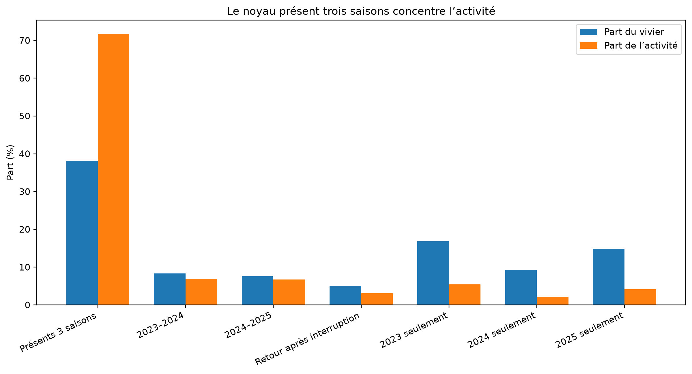
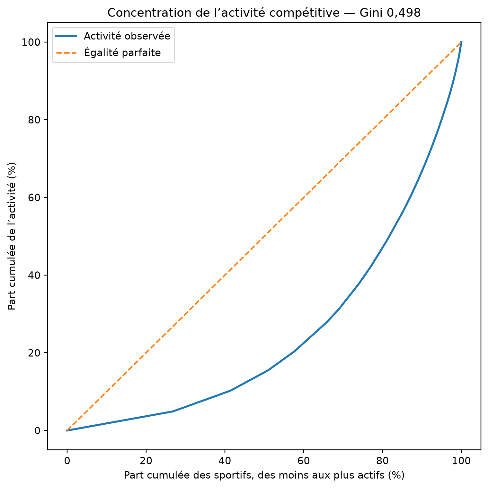
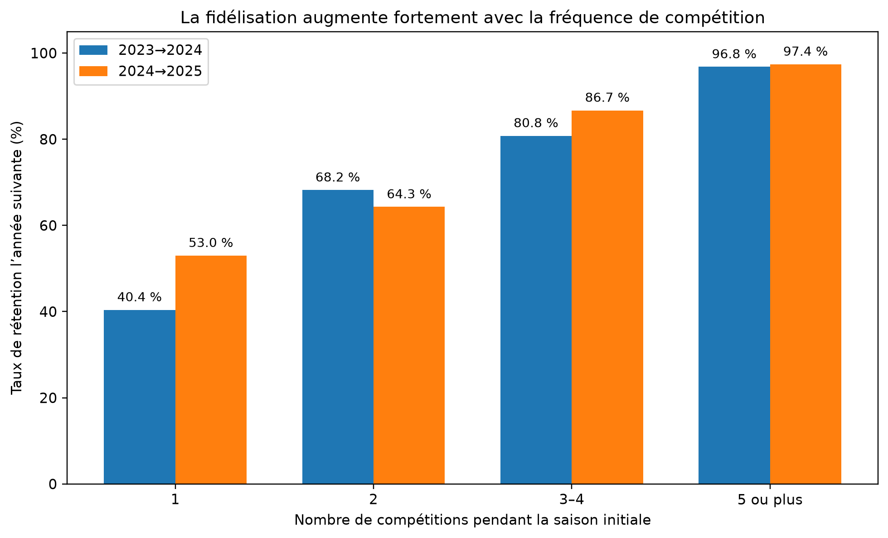
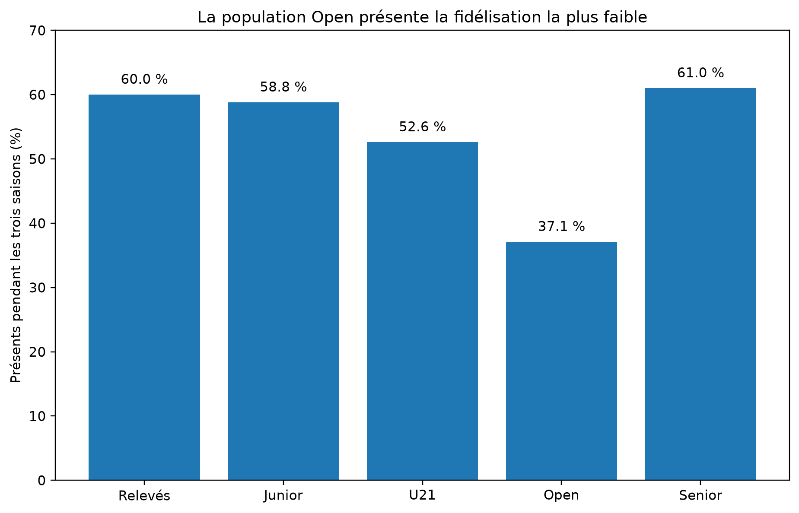

# Évolution de la participation et de la profondeur des champs

## Championnats de France de ski nautique classique — 2017-2026

**Rapport longitudinal comparatif — version 4**

## Préambule — Pourquoi cet observatoire ?

Créée en 1947, la Fédération française de ski nautique et de wakeboard approche de ses quatre-vingts ans d’existence. À l’échelle d’une telle histoire, l’observation d’une seule saison, d’un seul championnat ou de quelques résultats internationaux ne suffit pas à apprécier la trajectoire d’une discipline. Il est nécessaire de regarder le chemin parcouru, l’évolution de la population compétitive, le renouvellement des générations et la capacité du système fédéral à maintenir une pratique durablement accessible, structurée et vivante.

Cette mise en perspective répond également à la responsabilité particulière d’une fédération agréée et délégataire. Son action ne peut être appréciée uniquement à partir des sélections nationales, des sportifs inscrits sur les listes ministérielles ou des médailles obtenues. Elle doit aussi être confrontée aux missions de développement et de démocratisation de la pratique, à la prise en compte des publics cibles, à l’accès des jeunes et des femmes à la compétition, à la continuité des parcours sportifs et à la présence effective de la discipline sur le territoire.

Le Projet de performance fédéral 2025-2029 constitue le document stratégique de référence pour l’organisation de la haute performance. Par nature, il porte principalement sur les collectifs nationaux, les critères de sélection, les structures, l’accompagnement des sportifs et les objectifs de résultats internationaux.

Le PPF mentionne certaines fragilités du ski nautique, notamment la réduction du vivier dans plusieurs catégories. Il fournit cependant peu d’éléments permettant d’apprécier longitudinalement la réalité de la pratique compétitive nationale : évolution du nombre de concurrents, assiduité, entrées et sorties du système, durée des parcours, passage entre les catégories, profondeur réelle des champs ou concentration des titres et des médailles.

Cette limite ne remet pas en cause la fonction propre du PPF, centrée sur la performance. Elle laisse néanmoins subsister un angle mort entre le sommet du parcours sportif et la population compétitive dont ce sommet est issu. L’Observatoire trouve sa légitimité dans cet espace. Il constitue un outil complémentaire destiné à produire, dans la durée, les données nécessaires à la compréhension de la pratique fédérale.

Le point de départ de cette étude est la participation particulièrement faible observée aux Championnats de France de ski nautique classique. Cette compétition ne repose pas sur une qualification sportive nationale préalable. Sous réserve du respect des conditions administratives et réglementaires d’engagement, elle est accessible à l’ensemble des compétiteurs concernés.

Ses effectifs constituent donc un indicateur pertinent de la capacité du système fédéral à mobiliser ses pratiquants autour de son principal rendez-vous national. Une faible participation ne suffit pas à établir, à elle seule, un diagnostic définitif. Elle représente toutefois un signal d’alerte qui justifie de déterminer si la situation est conjoncturelle ou si elle traduit une contraction plus profonde de la pratique compétitive.

L’analyse longitudinale menée sur la période 2017-2026 vise ainsi à confronter les orientations institutionnelles, les objectifs de développement et les garanties attendues d’une fédération délégataire à la réalité mesurable de la compétition nationale.

## 1. Objet du rapport

Créée en 1947, la Fédération française de ski nautique et de wakeboard approche de ses quatre-vingts ans d’existence. Cette ancienneté rend nécessaire une mise en perspective de l’évolution de la pratique compétitive, au-delà de l’observation d’une seule saison, d’un championnat isolé ou des seuls résultats internationaux.

Le présent rapport analyse séparément chacun des Championnats de France de ski nautique classique organisés entre 2017 et 2026, puis confronte les dix diagnostics annuels. L’objectif n’est pas d’additionner les dix années dans une population statistique unique, mais d’observer l’évolution du système compétitif : contractions, rebonds, ruptures, renouvellement des pratiquants et transformations de la profondeur des champs.

Cette analyse répond également à la responsabilité particulière d’une fédération agréée et délégataire. Son action ne peut être appréciée uniquement à partir des sélections nationales, des sportifs inscrits sur les listes ministérielles ou des médailles obtenues. Elle doit aussi être confrontée à ses missions de développement et de démocratisation de la pratique, à sa capacité à toucher les publics identifiés comme prioritaires, à renouveler les générations, à favoriser la participation des femmes et à assurer la continuité des parcours sportifs.

Le Projet de performance fédéral 2025-2029 constitue le document stratégique de référence pour l’organisation de la haute performance. Il porte principalement sur les collectifs nationaux, les critères de sélection, les structures, l’accompagnement des sportifs et les objectifs de résultats internationaux. S’il relève certaines fragilités du ski nautique, son analyse de la pratique compétitive nationale demeure limitée. Il documente peu l’évolution du nombre de concurrents, leur assiduité, leur fidélisation, les entrées et sorties du système, la durée des parcours, le passage entre les catégories ou la profondeur réelle des épreuves.

Cette limite ne remet pas en cause la fonction propre du PPF, centrée sur la performance. Elle laisse toutefois subsister un angle mort entre le sommet du parcours sportif et la population compétitive dont celui-ci est issu. L’Observatoire trouve sa légitimité dans cet espace, en produisant des données longitudinales complémentaires sur la réalité de la pratique fédérale.

Le point de départ du rapport est la faible participation observée aux Championnats de France de ski nautique classique. Cette compétition ne reposant pas sur une qualification sportive nationale préalable, elle demeure, sous réserve des conditions administratives et réglementaires d’engagement, accessible à l’ensemble des compétiteurs concernés.

Ses effectifs constituent ainsi un indicateur pertinent de la capacité du système fédéral à mobiliser ses pratiquants autour de son principal rendez-vous national. Une faible participation ne suffit pas, à elle seule, à établir un diagnostic définitif. Elle constitue néanmoins un signal d’alerte qui justifie de déterminer si la situation est conjoncturelle ou si elle traduit une contraction structurelle de la pratique compétitive.

L’unité de comparaison retenue reste le Championnat de France annuel.

## 2. Méthode

### 2.1 Participants distincts

Le nombre de **participants distincts** correspond au nombre de personnes différentes recensées au cours d’un championnat.

Un même sportif n’est compté qu’une fois dans cet indicateur, même s’il participe dans plusieurs catégories et plusieurs épreuves.

### 2.2 Participations dans les champs

Les **participations dans les champs** correspondent à la somme des sportifs observés dans chaque champ (= catégorie × sexe × épreuve). Une même personne peut donc être comptée dans plusieurs champs.

Cet indicateur repose sur les résultats classés par épreuve. Un sportif recensé dans le championnat sans résultat classé dans une épreuve contribue au nombre de participants distincts, mais pas nécessairement aux participations dans les champs.

### 2.3 Grille annuelle de référence

Une grille analytique identique est appliquée à chaque année : 13 catégories × 2 sexes × 4 épreuves, soit **104 champs de référence par année**.

Cette grille standardisée est un outil de comparaison. Elle ne signifie pas que chacun des 104 champs figurait nécessairement au programme réglementaire de chaque édition.

Un champ sans résultat classé conserve un effectif nul. Le dénominateur constant permet de confronter directement les années.

### 2.4 Indicateurs de profondeur

La profondeur annuelle est appréciée à partir du nombre de champs effectifs, de l’effectif moyen et médian par champ, de la proportion de champs comptant de 1 à 3 participants et de l’effectif maximal observé.

### 2.5 Poids numérique des podiums

Pour une année `a`, la part des participations couverte par les podiums est calculée ainsi :

`P_a = [Σ_i min(3, n_(a,i)) / Σ_i n_(a,i)] × 100`

Dans cette formule, `n_(a,i)` représente l’effectif du champ `i` pendant l’année `a`.

Le calcul est pondéré par les participations : un champ de dix participants pèse davantage qu’un champ d’un participant.

Cet indicateur ne mesure ni la valeur sportive d’une médaille ni la probabilité individuelle d’en obtenir une.

### 2.6 Périmètre EMS consacré à l’assiduité

L’analyse de l’assiduité repose sur les participations approuvées enregistrées dans l’Event Management System de l’IWWF pour les compétitions de ski nautique organisées en France.

Les saisons 2023, 2024 et 2025 constituent la série principale comparable. Les données 2021 sont inutilisables pour cet objet et celles de 2022 sont incomplètes. La saison 2026, encore en cours à la date d’extraction du **23 juillet 2026**, n’est utilisée que comme prolongement provisoire.

Le périmètre annuel comprend les compétitions portant un code français de type `YYFRAxxx`. Les compétitions internationales portant un code `EURO`, même lorsqu’elles sont organisées en France, sont exclues de cette série.

### 2.7 Participation-compétition et intensité

Une **participation-compétition** correspond à la présence approuvée d’un sportif français dans une compétition EMS. Un même sportif n’est compté qu’une fois par compétition, quel que soit le nombre d’épreuves auxquelles il est inscrit.

L’intensité annuelle est mesurée par le nombre de compétitions dans lesquelles le sportif apparaît au cours d’une saison :

- 1 compétition ;
- 2 compétitions ;
- 3 à 4 compétitions ;
- 5 compétitions ou davantage.

Cette unité est distincte des participations dans les champs utilisées pour l’analyse des Championnats de France.

### 2.8 Profils de fidélisation

Les sportifs sont suivis individuellement entre 2023 et 2025 à partir d’une clé combinant nationalité, année de naissance et nom normalisé.

Sept profils sont distingués :

- présence pendant les trois saisons ;
- présence en 2023 et 2024 ;
- présence en 2024 et 2025 ;
- présence en 2023 et 2025 après une interruption en 2024 ;
- présence sur la seule saison 2023 ;
- présence sur la seule saison 2024 ;
- présence sur la seule saison 2025.

Une présence sur une seule saison dans la fenêtre observée ne peut pas être assimilée automatiquement à un abandon définitif.

### 2.9 Rétention annuelle

Pour une transition entre une saison `a` et la saison suivante `a+1`, le taux de rétention est calculé ainsi :

`R_a = [sportifs présents en a et en a+1 / sportifs présents en a] × 100`

Le taux mesure la continuité d’apparition dans les compétitions françaises enregistrées dans EMS. Il ne mesure ni le renouvellement de licence, ni la poursuite d’une pratique non compétitive, ni la participation à des compétitions organisées à l’étranger.

### 2.10 Conversion des inscriptions EMS en classements

Pour les Championnats de France 2023 à 2026, les inscriptions approuvées dans EMS sont rapprochées des résultats classés à l’échelle :

`année × compétition × population × catégorie × sexe × épreuve × sportif`

Les rapprochements d’identité tiennent compte des accents, ponctuations, noms tronqués et variantes nominatives. Les divergences de nationalité sont corrigées au niveau de la participation lorsque la nationalité EMS est explicitement établie.

Le Championnat U21/Open 2025 est exclu des taux de conversion en raison d’une collecte de résultats manifestement incomplète.

Le slalom, les figures et le saut sont distingués du combiné. Le combiné est un classement dérivé et non une quatrième prestation physiquement disputée.

## 3. Diagnostic annuel global

| Année | Participants distincts | F | H | Champs effectifs | Occupation | Participations dans les champs | Moyenne/champ | Médiane | Champs de 1 à 3 | Part de 1 à 3 | Maximum | Podiums |
|---:|---:|---:|---:|---:|---:|---:|---:|---:|---:|---:|---:|---:|
| 2017 | 103 | 32 | 71 | 59 / 104 | 56,7 % | 256 | 4,3 | 4,0 | 28 | 47,5 % | 15 | 57,0 % |
| 2018 | 101 | 32 | 69 | 66 / 104 | 63,5 % | 224 | 3,4 | 3,0 | 43 | 65,2 % | 17 | 71,0 % |
| 2019 | 99 | 31 | 68 | 67 / 104 | 64,4 % | 229 | 3,4 | 3,0 | 42 | 62,7 % | 13 | 69,4 % |
| 2020 | 82 | 22 | 60 | 48 / 104 | 46,2 % | 172 | 3,6 | 3,0 | 26 | 54,2 % | 9 | 68,6 % |
| 2021 | 110 | 30 | 80 | 57 / 104 | 54,8 % | 176 | 3,1 | 3,0 | 33 | 57,9 % | 8 | 73,9 % |
| 2022 | 102 | 30 | 72 | 49 / 104 | 47,1 % | 189 | 3,9 | 3,0 | 30 | 61,2 % | 18 | 60,3 % |
| 2023 | 109 | 32 | 77 | 69 / 104 | 66,3 % | 221 | 3,2 | 3,0 | 44 | 63,8 % | 10 | 70,6 % |
| 2024 | 91 | 32 | 59 | 63 / 104 | 60,6 % | 193 | 3,1 | 3,0 | 43 | 68,3 % | 10 | 75,6 % |
| 2025 | 88 | 28 | 60 | 58 / 104 | 55,8 % | 173 | 3,0 | 3,0 | 40 | 69,0 % | 11 | 74,0 % |
| 2026 | 69 | 26 | 43 | 52 / 104 | 50,0 % | 141 | 2,7 | 3,0 | 36 | 69,2 % | 7 | 79,4 % |

Entre 2017 et 2026, les participants distincts passent de **103 à 69**, soit **34 personnes de moins** et une évolution de **-33,0 %**.

Les participations dans les champs passent de **256 à 141**, soit **115 de moins** et une évolution de **-44,9 %**.

Cette comparaison entre les extrémités ne suffit pas à décrire l’évolution. La série fait apparaître plusieurs séquences distinctes.

## 4. Périodisation de l’évolution

### 4.1 De 2017 à 2019 : stabilité des effectifs, amincissement des champs

Les participants distincts demeurent relativement stables : **103 en 2017, 101 en 2018 et 99 en 2019**.

Les participations dans les champs passent toutefois de **256 à 224 puis 229**. La médiane diminue de **4 à 3**, tandis que le poids des podiums passe de **57,0 %** à **71,0 %**, puis **69,4 %**.

La fragilisation de la profondeur apparaît donc avant la contraction récente du nombre de participants.

### 4.2 L’année 2020 : contraction générale

En 2020, le championnat réunit **82 participants distincts**, **48 champs effectifs** et **172 participations dans les champs**.

Cette édition constitue une rupture statistique. Le rapport décrit cette rupture sans lui attribuer de cause.

### 4.3 Les années 2021 et 2022 : deux configurations atypiques

En 2021, le nombre de participants distincts atteint le maximum de la période avec **110 personnes**, mais les participations dans les champs restent limitées à **176**, réparties dans **57 champs effectifs**.

En 2022, seulement **49 champs** sont effectifs, mais ils réunissent **189 participations** et l’un d’eux atteint **18 participants**. Le poids des podiums revient à **60,3 %**.

Les deux éditions présentent donc des structures très différentes.

### 4.4 L’année 2023 : élargissement sans retour à la profondeur de 2017

En 2023, le nombre de champs effectifs atteint son maximum avec **69 champs sur 104**, et le championnat réunit **109 participants distincts**.

Cependant, **44 champs sur 69**, soit **63,8 %**, ne comptent que 1 à 3 participants. L’effectif moyen est de **3,2 par champ**, contre **4,3 en 2017**.

L’architecture compétitive s’élargit donc sans retrouver la profondeur du début de période.

### 4.5 De 2024 à 2026 : contraction sur trois éditions successives

| Année | Participants distincts | Participations dans les champs | Champs effectifs | Champs de 1 à 3 | Podiums |
|---:|---:|---:|---:|---:|---:|
| 2023 | 109 | 221 | 69 / 104 | 44 / 69 | 70,6 % |
| 2024 | 91 | 193 | 63 / 104 | 43 / 63 | 75,6 % |
| 2025 | 88 | 173 | 58 / 104 | 40 / 58 | 74,0 % |
| 2026 | 69 | 141 | 52 / 104 | 36 / 52 | 79,4 % |

Entre 2023 et 2026, les participants distincts passent de **109 à 69**, les participations dans les champs de **221 à 141** et les champs effectifs de **69 à 52**.

Cette succession constitue la contraction récente la plus lisible de la période.

## 5. Comparaison par population

| Année | Relève : participations | Relève : champs | U21/Open : participations | U21/Open : champs | Seniors : participations | Seniors : champs |
|---:|---:|---:|---:|---:|---:|---:|
| 2017 | 134 | 28 / 40 | 62 | 8 / 16 | 60 | 23 / 48 |
| 2018 | 112 | 31 / 40 | 46 | 16 / 16 | 66 | 19 / 48 |
| 2019 | 113 | 32 / 40 | 70 | 16 / 16 | 46 | 19 / 48 |
| 2020 | 86 | 23 / 40 | 64 | 16 / 16 | 22 | 9 / 48 |
| 2021 | 93 | 30 / 40 | 52 | 14 / 16 | 31 | 13 / 48 |
| 2022 | 52 | 17 / 40 | 66 | 8 / 16 | 71 | 24 / 48 |
| 2023 | 78 | 27 / 40 | 74 | 16 / 16 | 69 | 26 / 48 |
| 2024 | 67 | 22 / 40 | 46 | 16 / 16 | 80 | 25 / 48 |
| 2025 | 64 | 26 / 40 | 26 | 7 / 16 | 83 | 25 / 48 |
| 2026 | 81 | 31 / 40 | 45 | 13 / 16 | 15 | 8 / 48 |

### 5.1 Relève : maintien des champs, amincissement de leur profondeur

La Relève compte **28 champs effectifs et 134 participations en 2017**, contre **31 champs et 81 participations en 2026**.

L’effectif moyen passe de **4,8 à 2,6 participants par champ effectif**.

La part des champs de 1 à 3 participants passe parallèlement de **32,1 % à 71,0 %**.

### 5.2 U21 / Open : une structure très volatile

En 2018, l’ensemble U21/Open compte **46 participations réparties dans les 16 champs de référence**, avec une médiane de **2,5** et un poids des podiums de **80,4 %**.

En 2022, il compte **66 participations dans seulement 8 champs**, avec une médiane de **7,5**, un maximum de **18 participants** et un poids des podiums de **36,4 %**.

Des volumes proches peuvent donc correspondre à des structures compétitives très différentes.

### 5.3 Seniors : une rupture propre à 2026

Les Seniors passent de **83 participations dans 25 champs en 2025** à **15 participations dans 8 champs en 2026**.

Tous les champs Seniors disputés en 2026 comptent de 1 à 3 participants. Cette situation ne doit pas être présentée comme l’aboutissement d’une baisse continue sur dix ans.

## 6. Comparaison par sexe

Les données de cette section sont des participations dans les champs et non des personnes distinctes.

| Année | Femmes : participations | Femmes : champs | Femmes : médiane | Femmes : podiums | Hommes : participations | Hommes : champs | Hommes : médiane | Hommes : podiums |
|---:|---:|---:|---:|---:|---:|---:|---:|---:|
| 2017 | 86 | 25 / 52 | 3,0 | 62,8 % | 170 | 34 / 52 | 5,0 | 54,1 % |
| 2018 | 81 | 28 / 52 | 3,0 | 81,5 % | 143 | 38 / 52 | 3,0 | 65,0 % |
| 2019 | 80 | 30 / 52 | 2,5 | 83,8 % | 149 | 37 / 52 | 4,0 | 61,7 % |
| 2020 | 68 | 21 / 52 | 3,0 | 76,5 % | 104 | 27 / 52 | 3,0 | 63,5 % |
| 2021 | 74 | 26 / 52 | 3,0 | 79,7 % | 102 | 31 / 52 | 3,0 | 69,6 % |
| 2022 | 62 | 20 / 52 | 3,0 | 74,2 % | 127 | 29 / 52 | 3,0 | 53,5 % |
| 2023 | 76 | 29 / 52 | 3,0 | 80,3 % | 145 | 40 / 52 | 3,0 | 65,5 % |
| 2024 | 65 | 23 / 52 | 3,0 | 83,1 % | 128 | 40 / 52 | 3,0 | 71,9 % |
| 2025 | 38 | 23 / 52 | 1,0 | 97,4 % | 135 | 35 / 52 | 3,0 | 67,4 % |
| 2026 | 54 | 21 / 52 | 3,0 | 87,0 % | 87 | 31 / 52 | 3,0 | 74,7 % |

Les champs féminins sont, sur la plupart des éditions, moins nombreux et moins profonds que les champs masculins.

L’année 2025 est particulièrement fragile : **38 participations féminines**, **23 champs effectifs**, une médiane de **1 participante** et un poids des podiums de **97,4 %**.

En 2026, les participations féminines remontent à **54**, mais le poids des podiums reste élevé, à **87,0 %**.

## 7. Comparaison par épreuve

| Épreuve | Participations 2017 | Participations 2026 | Évolution | Médiane 2017 | Médiane 2026 | Podiums 2017 | Podiums 2026 |
|---|---:|---:|---:|---:|---:|---:|---:|
| Slalom | 101 | 61 | -40 (-39,6 %) | 6,0 | 3,0 | 41,6 % | 72,1 % |
| Figures | 63 | 37 | -26 (-41,3 %) | 3,5 | 1,0 | 63,5 % | 78,4 % |
| Saut | 47 | 22 | -25 (-53,2 %) | 3,0 | 2,0 | 68,1 % | 90,9 % |
| Combiné | 45 | 21 | -24 (-53,3 %) | 3,0 | 1,5 | 71,1 % | 90,5 % |

Le slalom demeure l’épreuve la plus fournie, mais ses participations passent de **101 à 61**, sa médiane de **6 à 3** et le poids de ses podiums de **41,6 % à 72,1 %**.

En figures, la médiane tombe à **1 participant en 2026**.

Le saut et le combiné demeurent durablement fragiles. En 2026, leurs podiums couvrent respectivement **90,9 % et 90,5 %** des participations.

## 8. Lecture longitudinale

L’évolution 2017-2026 ne se résume ni à une baisse régulière ni à la seule situation de 2026.

Elle combine un amincissement précoce des champs entre 2017 et 2019, une rupture générale en 2020, deux configurations atypiques en 2021 et 2022, un élargissement sans réelle profondeur en 2023, puis une contraction continue entre 2023 et 2026.

Le nombre de champs occupés ne permet donc pas, à lui seul, d’apprécier la solidité du système compétitif.

## 9. De l’inscription EMS au classement

La comparaison entre les inscriptions approuvées dans EMS et les résultats publiés permet de vérifier si la faiblesse des champs provient d’une déperdition importante entre l’engagement administratif et le classement effectif.

### 9.1 Conversion au niveau des sportifs

Hors Championnat U21/Open 2025, dont les résultats disponibles sont incomplets, le périmètre exploitable comprend **299 présences de sportifs dans un bloc annuel de championnat**.

Parmi elles :

- **294** donnent lieu à au moins un classement, soit **98,3 %** ;
- **286** présentent une conversion complète de tous les champs d’inscription, soit **95,7 %** ;
- **8** correspondent à une conversion partielle ;
- **5** ne donnent lieu à aucun classement retrouvé.

La déperdition totale entre inscription approuvée et apparition dans les classements reste donc marginale.

### 9.2 Conversion des disciplines physiquement disputées

Pour le slalom, les figures et le saut :

- **565 inscriptions approuvées** sont recensées ;
- **550 classements correspondants** sont retrouvés ;
- soit un taux de conversion de **97,3 %**.

| Année | Population | Inscriptions physiques | Classements retrouvés | Taux |
|---:|---|---:|---:|---:|
| 2023 | Relève | 52 | 52 | 100,0 % |
| 2023 | U21/Open | 61 | 58 | 95,1 % |
| 2023 | Seniors | 67 | 61 | 91,0 % |
| 2024 | Relève | 51 | 51 | 100,0 % |
| 2024 | U21/Open | 38 | 36 | 94,7 % |
| 2024 | Seniors | 70 | 68 | 97,1 % |
| 2025 | Relève | 51 | 50 | 98,0 % |
| 2025 | Seniors | 58 | 58 | 100,0 % |
| 2026 | Relève | 65 | 65 | 100,0 % |
| 2026 | U21/Open | 37 | 36 | 97,3 % |
| 2026 | Seniors | 15 | 15 | 100,0 % |

### 9.3 Cas particulier du combiné

Pour le combiné :

- **112 inscriptions ou positions attendues** sont recensées ;
- **105 classements** sont retrouvés ;
- soit un taux de conversion de **93,8 %**.

Ce taux inférieur ne doit pas être interprété comme autant de non-participations supplémentaires. L’absence d’un résultat dans une discipline constitutive peut empêcher mécaniquement l’établissement du classement combiné.

### 9.4 Interprétation

La contraction des Championnats de France ne peut pas être principalement expliquée par une déperdition massive entre l’inscription finale et la compétition classée.

Le phénomène déterminant se situe davantage en amont :

- dans le nombre de sportifs qui entrent effectivement dans le championnat ;
- dans le nombre de disciplines auxquelles ils s’engagent ;
- dans la profondeur des catégories et des champs ;
- dans la capacité du circuit national à transformer une participation ponctuelle en engagement répété.

## 10. Assiduité, fidélisation et concentration du circuit national

### 10.1 Un volume annuel relativement stable qui masque une circulation importante

Les compétitions françaises enregistrées dans EMS réunissent :

| Saison | Compétiteurs français distincts | Participations-compétitions |
|---:|---:|---:|
| 2023 | 206 | 563 |
| 2024 | 191 | 547 |
| 2025 | 198 | 541 |

Le volume annuel reste proche de 200 compétiteurs, mais cette stabilité agrégée masque des entrées et sorties nombreuses.

Entre 2023 et 2024 :

- 140 sportifs sont maintenus ;
- 66 sortent de la série observée ;
- 51 entrent ;
- le taux de rétention est de **68,0 %**.

Entre 2024 et 2025 :

- 138 sportifs sont maintenus ;
- 53 sortent ;
- 60 entrent ;
- le taux de rétention atteint **72,3 %**.

### 10.2 Un noyau permanent et une périphérie importante

Sur les trois saisons, **302 compétiteurs français distincts** sont recensés.

| Profil | Sportifs | Part du vivier |
|---|---:|---:|
| Présents les trois saisons | 115 | 38,1 % |
| Présents deux saisons | 63 | 20,9 % |
| Présents une seule saison | 124 | 41,1 % |

La cohorte active en 2023 compte 206 sportifs. Parmi eux :

- 140 sont encore présents en 2024 ;
- 130 réapparaissent en 2025 ;
- 115 sont présents sans interruption pendant les trois saisons, soit **55,8 %** ;
- 15 reviennent en 2025 après une absence en 2024.

Une présence sur une seule saison ne peut donc pas être assimilée à une sortie définitive.

### 10.3 Une activité fortement concentrée

Les 115 sportifs présents pendant les trois saisons représentent **38,1 % du vivier triennal**, mais réalisent **1 186 des 1 651 participations-compétitions**, soit **71,8 % de l’activité**.

À l’inverse, les 124 sportifs présents une seule saison représentent **41,1 % du vivier**, mais seulement **190 participations-compétitions**, soit **11,5 % de l’activité**.

Chaque année, le noyau permanent représente entre **55,8 % et 60,2 % des sportifs actifs**, mais entre **68,2 % et 75,0 % de l’activité**.

Le classement des sportifs selon leur activité confirme cette concentration :

- les 10 % les plus actifs réalisent **33,1 %** de l’activité ;
- les 20 % les plus actifs en réalisent **52,7 %** ;
- la moitié la plus active concentre **85,0 %** des participations ;
- la moitié la moins active n’en réalise que **15,0 %**.

Le coefficient de Gini, calculé sur le nombre de compétitions disputées par sportif, atteint **0,498**.

Le circuit n’est donc pas fermé en termes d’accès. Il accueille chaque année des sportifs nouveaux dans la fenêtre observée. Son activité effective repose toutefois très majoritairement sur une fraction durable et intensive du vivier.

### 10.4 La fréquence de compétition comme principal indicateur de fidélisation

La probabilité de rester actif la saison suivante augmente fortement avec le nombre de compétitions disputées pendant la saison initiale.

| Compétitions pendant la saison initiale | Rétention 2023→2024 | Rétention 2024→2025 |
|---|---:|---:|
| 1 compétition | 40,4 % | 53,0 % |
| 2 compétitions | 68,2 % | 64,3 % |
| 3 à 4 compétitions | 80,8 % | 86,7 % |
| 5 compétitions ou davantage | 96,8 % | 97,4 % |

Les sportifs maintenus avaient disputé en moyenne **3,19 compétitions en 2023** et **3,35 en 2024**. Les sportifs qui sortent n’en avaient disputé respectivement que **1,76** et **1,60**. Dans les deux transitions, la médiane est de **3 compétitions** pour les maintenus et d’**une seule compétition** pour les sortants.

Les pratiquants limités à une ou deux compétitions représentent :

- **83,3 % des sorties** entre 2023 et 2024 ;
- **86,8 % des sorties** entre 2024 et 2025.

La difficulté principale ne réside donc pas dans la fidélisation des sportifs déjà régulièrement engagés. Elle se situe dans la transformation d’une participation ponctuelle en pratique répétée.

### 10.5 La fidélisation des entrants observés en 2024

Parmi les 51 sportifs visibles en 2024 mais absents de la série 2023 :

- 23 sont encore présents en 2025 ;
- 28 ne le sont plus ;
- soit une rétention de **45,1 %**.

Parmi les 140 sportifs déjà présents en 2023, 115 sont encore actifs en 2025, soit **82,1 %**.

La différence dépend surtout de l’intensité de la première saison observée :

- parmi les 43 entrants ayant disputé une ou deux compétitions, 15 sont maintenus, soit **34,9 %** ;
- les 8 entrants ayant disputé au moins trois compétitions sont tous maintenus en 2025.

Le terme « entrant » signifie ici **non observé dans les compétitions françaises EMS de la saison précédente**. Il ne prouve ni une première licence, ni une première compétition de carrière.

### 10.6 Une fidélisation comparable entre femmes et hommes

Les taux de rétention annuels sont proches :

| Transition | Femmes | Hommes |
|---|---:|---:|
| 2023→2024 | 69,0 % | 67,6 % |
| 2024→2025 | 71,2 % | 72,7 % |

La sous-représentation féminine ne semble donc pas résulter d’un décrochage annuel nettement supérieur.

Le vivier féminin demeure néanmoins réduit :

- 58 femmes sur 206 sportifs en 2023, soit **28,2 %** ;
- 52 sur 191 en 2024, soit **27,2 %** ;
- 52 sur 198 en 2025, soit **26,3 %**.

La faiblesse de la représentation féminine semble ainsi se situer davantage dans le volume initial du vivier et dans le recrutement que dans une fidélisation spécifiquement plus faible.

### 10.7 Une fragilité particulière de la population Open

Dans la cohorte active en 2023, la part des sportifs présents pendant les trois saisons atteint :

| Population initiale en 2023 | Présents les trois saisons |
|---|---:|
| Relève | 60,0 % |
| Junior | 58,8 % |
| U21 | 52,6 % |
| Open | 37,1 % |
| Seniors | 61,0 % |

La population Open présente la continuité la plus faible :

- 45,7 % de sorties entre 2023 et 2024 ;
- 35,5 % entre 2024 et 2025.

Les données établissent cette rupture statistique, mais elles n’en déterminent pas les causes. Les contraintes d’études, d’entrée dans la vie professionnelle, de mobilité, de coût ou d’accès aux sites constituent des hypothèses à documenter séparément.

La population U21 apparaît également fluctuante, avec 40,0 % de sorties entre 2024 et 2025, sur un effectif de 15 sportifs.

### 10.8 Les seniors comme ossature du circuit

Les seniors représentent :

- 105 des 206 compétiteurs en 2023 ;
- 105 des 191 en 2024 ;
- 107 des 198 en 2025.

Ils constituent donc plus de la moitié du vivier français observé chaque année. Leur rétention annuelle est identique dans les deux transitions : **72,4 %**.

Cette stabilité du circuit EMS doit être distinguée de la rupture spécifique observée dans les résultats du Championnat de France Seniors 2026. Une population peut demeurer nombreuse dans l’activité compétitive nationale tout en étant faiblement mobilisée sur une édition particulière du championnat national.

### 10.9 La multidisciplinarité accompagne l’intégration sans l’expliquer seule

Chez les compétiteurs déjà présents en 2023, la rétention en 2025 augmente avec le nombre de disciplines pratiquées en 2024 :

- une discipline : **78,0 %** ;
- deux disciplines : **86,7 %** ;
- trois disciplines : **91,2 %**.

Cette progression s’accompagne toutefois d’un nombre moyen de compétitions plus élevé. La multidisciplinarité peut donc être un marqueur d’intégration au circuit sans constituer un facteur causal autonome.

Chez les entrants de 2024, aucune relation régulière n’apparaît entre le nombre de disciplines et la fidélisation. À nombre de compétitions comparable, les effectifs sont trop faibles et les taux trop irréguliers pour conclure.

Le résultat le plus robuste reste la fréquence de compétition.

### 10.10 Prolongement provisoire en 2026

Au **23 juillet 2026**, 140 compétiteurs français sont déjà visibles dans EMS.

Parmi les 198 sportifs actifs en 2025 :

- 101 sont déjà présents en 2026 ;
- soit un taux minimal provisoire de **51,0 %**.

Parmi les 115 membres du noyau présent en 2023, 2024 et 2025 :

- 72 sont déjà visibles en 2026 ;
- soit **62,6 %**.

Parmi les 45 sportifs observés seulement en 2025 dans la fenêtre initiale :

- 13 sont déjà présents en 2026 ;
- soit **28,9 %**.

Au total, au moins **24 des 124 sportifs initialement classés comme présents une seule saison entre 2023 et 2025** réapparaissent en 2026. La catégorie « une seule saison » combine donc des sorties durables, des interruptions temporaires et des effets de bord liés à la fenêtre d’observation.

Ces taux sont des minimums provisoires et ne peuvent pas être comparés directement aux taux calculés sur des saisons complètes.

### 10.11 Lecture générale du module

Le circuit national ne repose pas exclusivement sur un groupe fermé de compétiteurs immuables. Il accueille chaque année des entrants et connaît un renouvellement réel.

Son fonctionnement effectif demeure cependant fortement concentré :

- un noyau de 38,1 % du vivier réalise 71,8 % de l’activité ;
- les 20 % les plus actifs réalisent 52,7 % des participations ;
- les sorties concernent principalement les sportifs limités à une ou deux compétitions ;
- les pratiquants engagés dans cinq compétitions ou davantage sont presque toujours maintenus la saison suivante.

L’enjeu central est donc moins l’accès formel à une première compétition que la capacité du système à créer les conditions d’une participation répétée, accessible et durable.

## 11. Limites

Les participations dans les champs reposent sur les résultats classés et ne représentent pas nécessairement la totalité des inscriptions.

La grille de 104 champs est une grille analytique standardisée et ne préjuge pas du programme réglementaire exact de chaque édition.

L’absence d’un sportif dans un Championnat de France ne permet pas de conclure à un abandon de la pratique.

L’absence d’un sportif dans les compétitions françaises EMS d’une saison ne permet pas davantage de conclure à un arrêt de la pratique. Il peut participer à l’étranger, pratiquer sans compétition ou revenir après une interruption.

Les données EMS décrivent des participations approuvées. Elles ne constituent pas, à elles seules, une preuve de départ effectif dans chaque épreuve. Le rapprochement avec les résultats montre toutefois que la conversion est très élevée sur les Championnats de France étudiés.

Les saisons EMS 2023 à 2025 constituent la fenêtre longitudinale principale. Cette durée permet d’identifier des profils de continuité, mais reste insuffisante pour qualifier définitivement une carrière sportive ou un abandon.

La saison 2026 est incomplète à la date d’extraction du 23 juillet 2026. Les indicateurs qui la mobilisent sont explicitement présentés comme provisoires.

Les groupes croisant sexe, âge, intensité et multidisciplinarité peuvent présenter de faibles effectifs. Les pourcentages correspondants ne doivent pas être interprétés isolément.

Les relations observées entre fréquence de compétition, multidisciplinarité et fidélisation sont des associations statistiques. Elles ne démontrent pas un lien causal et ne permettent pas d’identifier directement le rôle respectif du coût, de la distance, de l’encadrement, des contraintes scolaires, professionnelles ou familiales.

## 12. Conclusion générale

Sur la période 2017-2026, les Championnats de France de ski nautique classique connaissent une contraction nette de leur participation et, plus encore, de la profondeur de leurs champs.

Les participants distincts passent de **103 à 69**, soit **-33,0 %**, tandis que les participations dans les champs diminuent de **256 à 141**, soit **-44,9 %**. Le poids numérique des podiums atteint **79,4 %** en 2026, contre **57,0 %** en 2017.

Cette évolution n’est ni régulière ni uniforme. Elle combine un amincissement précoce des champs, des ruptures annuelles, des configurations atypiques et une contraction particulièrement lisible entre 2023 et 2026. Elle affecte différemment les populations, les sexes et les épreuves.

Le rapprochement entre EMS et les classements montre que la faiblesse observée ne provient pas principalement d’une déperdition entre l’inscription finale et le résultat. Pour le slalom, les figures et le saut, **97,3 % des inscriptions approuvées** donnent lieu à un classement correspondant sur le périmètre exploitable.

L’analyse du circuit français EMS apporte un second enseignement. Le volume annuel demeure proche de 200 compétiteurs entre 2023 et 2025, mais l’activité est très concentrée. Les 115 sportifs présents pendant les trois saisons représentent **38,1 % du vivier** et réalisent **71,8 % de l’activité**. Les 20 % les plus actifs concentrent **52,7 % des participations**.

Le système apparaît ainsi ouvert à des entrants, mais peine à transformer une partie de ces entrées en pratique répétée. La rétention n’est que de **40,4 % à 53,0 %** après une seule compétition, contre **96,8 % à 97,4 %** à partir de cinq compétitions annuelles.

La difficulté principale ne semble donc pas résider dans la fidélisation des sportifs déjà fortement intégrés. Elle se situe à la périphérie du circuit : accès à plusieurs compétitions, maintien après une première expérience, continuité autour de la population Open et capacité à élargir durablement le vivier féminin.

Les seniors constituent parallèlement l’ossature numérique du circuit EMS, alors même que leur Championnat de France 2026 connaît une rupture particulière. Cette dissociation montre qu’un vivier compétitif ne se mobilise pas automatiquement autour du principal rendez-vous national.

La solidité de la filière ne peut dès lors être appréciée à partir du seul nombre de champs ouverts, du nombre de titres distribués ou des résultats internationaux. Elle doit également être évaluée à partir :

- du nombre de personnes effectivement engagées ;
- de la profondeur des champs ;
- de la répétition des participations ;
- de la continuité des parcours ;
- de la capacité à retenir les entrants ;
- de la représentation des femmes ;
- du passage entre les catégories ;
- et de la mobilisation autour des Championnats de France.

L’enjeu fédéral central est de créer les conditions matérielles, territoriales, sportives et économiques permettant à une première participation de devenir une pratique compétitive régulière et durable.

## Sources de données

### Championnats de France 2017-2026

- `data/exports/diagnostic_annuel_champs_2017_2026.csv`
- `data/exports/diagnostic_annuel_par_axes_2017_2026.csv`

### Inscriptions EMS et résultats classés

- `data/processed/ems_championnats_france_participants_normalises_2023_2026.csv`
- `data/processed/comparaison_ems_resultats_reconciliee_2023_2026.csv`
- `data/processed/conversion_ems_resultats_par_bloc_2023_2026.csv`
- `data/processed/conversion_disciplines_physiques_combine_2023_2026.csv`

### Assiduité, fidélisation et concentration

- `data/processed/ems_panel_competiteurs_francais_2023_2025.csv`
- `data/processed/ems_transitions_competiteurs_2023_2025.csv`
- `data/processed/ems_poids_profils_fidelisation_2023_2025.csv`
- `data/processed/ems_concentration_activite_2023_2025.csv`
- `data/processed/ems_retention_selon_intensite_2023_2025.csv`
- `data/processed/ems_cohorte_2023_sexe_age.csv`
- `data/processed/ems_matrice_transitions_age_2023_2025.csv`
- `data/processed/ems_fidelisation_multidisciplinarite_2024_2025.csv`
- `data/processed/ems_prolongement_profils_2026_provisoire.csv`
