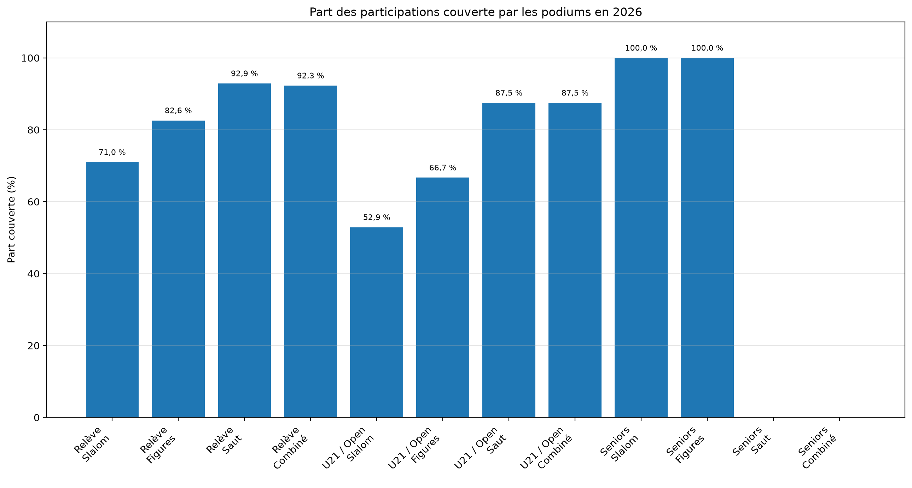

# Participation et profondeur des podiums

## Championnats de France de ski nautique classique — 2017-2026

**Rapport V1 — juillet 2026**

## 1. Objet et périmètre

Ce rapport analyse les sportifs distincts effectivement recensés dans les Championnats de France de ski nautique classique intégrés à la base pour la période 2017-2026.

Un même sportif n’est compté qu’une fois par année dans l’indicateur de participation annuelle, même s’il participe dans plusieurs catégories et plusieurs épreuves.

Conformément à la terminologie du PPF 2025-2029, le ski nautique constitue la discipline reconnue de haut niveau. Le slalom, les figures, le saut et le combiné sont des épreuves du ski nautique ; ils ne sont pas traités ici comme des disciplines autonomes.

Le combiné est une épreuve fondée sur les performances réalisées dans le slalom, les figures et le saut.

### Participants distincts et participations dans les champs

Le nombre de **participants distincts** correspond au nombre de personnes différentes recensées au cours d’une année.

Les **participations dans les champs** correspondent à la somme des sportifs observés dans chaque champ catégorie × sexe × épreuve. Une même personne peut donc être comptée dans plusieurs champs.

Ces deux indicateurs ne doivent pas être additionnés ni interprétés comme s’ils mesuraient la même réalité.

## 2. Évolution de la participation annuelle

| Année | Participants distincts |
|---:|---:|
| 2017 | 103 |
| 2018 | 101 |
| 2019 | 99 |
| 2020 | 82 |
| 2021 | 110 |
| 2022 | 102 |
| 2023 | 109 |
| 2024 | 91 |
| 2025 | 88 |
| 2026 | 69 |

Entre 2017 et 2026, la participation annuelle passe de **103 à 69 sportifs distincts**, soit **34 personnes de moins** et une évolution de **-33,0 %**.

La contraction récente est également visible entre 2023 et 2026 : **109 à 69**, soit **40 personnes de moins** et **-36,7 %**.

## 3. Mesure de la profondeur des podiums

La part théorique du champ couverte par le podium est calculée séparément dans chaque champ catégorie × sexe × épreuve.

Pour un champ de `n` participants, l’indicateur est : `min(100 ; 3 / n × 100)`.

Cet indicateur ne mesure pas la probabilité sportive individuelle d’obtenir une médaille. Il mesure uniquement le poids des trois places du podium au regard de la taille du champ.

### Situation générale en 2026

Le référentiel comprend **13 classes**, deux sexes et quatre épreuves, soit **104 champs théoriquement possibles**.

En 2026, **52 champs** comptent au moins un résultat et **52 champs** sont vides.

Parmi les 52 champs effectivement disputés :

- **36**, soit **69,2 %**, comptent de un à trois participants ;
- **43**, soit **82,7 %**, comptent au maximum quatre participants ;
- **49**, soit **94,2 %**, comptent au maximum cinq participants ;
- le champ le plus fourni ne compte que **7 participants**.

Au total, les places effectivement couvertes par les podiums représentent **112 places sur 141 participations**, soit **79,4 %**.

## 4. Tableau détaillé par catégorie, sexe et épreuve — 2026

Chaque cellule indique : **nombre de participants / part théorique du champ couverte par le podium**.

| Catégorie | Sexe | Slalom | Figures | Saut | Combiné |
|---|---|---:|---:|---:|---:|
| U8 | Femmes | 0 / — | 0 / — | 0 / — | 0 / — |
| U8 | Hommes | 0 / — | 1 / 100,0 % | 0 / — | 0 / — |
| U10 | Femmes | 3 / 100,0 % | 3 / 100,0 % | 0 / — | 0 / — |
| U10 | Hommes | 2 / 100,0 % | 1 / 100,0 % | 1 / 100,0 % | 1 / 100,0 % |
| U12 | Femmes | 3 / 100,0 % | 3 / 100,0 % | 1 / 100,0 % | 1 / 100,0 % |
| U12 | Hommes | 6 / 50,0 % | 5 / 60,0 % | 4 / 75,0 % | 4 / 75,0 % |
| U14 | Femmes | 2 / 100,0 % | 1 / 100,0 % | 1 / 100,0 % | 1 / 100,0 % |
| U14 | Hommes | 4 / 75,0 % | 1 / 100,0 % | 1 / 100,0 % | 1 / 100,0 % |
| U17 | Femmes | 5 / 60,0 % | 4 / 75,0 % | 3 / 100,0 % | 2 / 100,0 % |
| U17 | Hommes | 6 / 50,0 % | 4 / 75,0 % | 3 / 100,0 % | 3 / 100,0 % |
| U21 | Femmes | 0 / — | 1 / 100,0 % | 0 / — | 0 / — |
| U21 | Hommes | 7 / 42,9 % | 5 / 60,0 % | 4 / 75,0 % | 4 / 75,0 % |
| Open | Femmes | 5 / 60,0 % | 5 / 60,0 % | 3 / 100,0 % | 3 / 100,0 % |
| Open | Hommes | 5 / 60,0 % | 1 / 100,0 % | 1 / 100,0 % | 1 / 100,0 % |
| 35+ | Femmes | 3 / 100,0 % | 0 / — | 0 / — | 0 / — |
| 35+ | Hommes | 0 / — | 0 / — | 0 / — | 0 / — |
| 45+ | Femmes | 1 / 100,0 % | 0 / — | 0 / — | 0 / — |
| 45+ | Hommes | 2 / 100,0 % | 0 / — | 0 / — | 0 / — |
| 55+ | Femmes | 0 / — | 0 / — | 0 / — | 0 / — |
| 55+ | Hommes | 3 / 100,0 % | 1 / 100,0 % | 0 / — | 0 / — |
| 65+ | Femmes | 0 / — | 0 / — | 0 / — | 0 / — |
| 65+ | Hommes | 3 / 100,0 % | 0 / — | 0 / — | 0 / — |
| 70+ | Femmes | 0 / — | 0 / — | 0 / — | 0 / — |
| 70+ | Hommes | 0 / — | 0 / — | 0 / — | 0 / — |
| 75+ | Femmes | 0 / — | 0 / — | 0 / — | 0 / — |
| 75+ | Hommes | 1 / 100,0 % | 1 / 100,0 % | 0 / — | 0 / — |

## 5. Tableau regroupé par population — 2026

Les populations sont regroupées comme suit : **Relève** = U8 à U17 ; **U21 / Open** = U21 et Open ; **Seniors** = 35+ à 75+.

La ligne **H/F** additionne les champs féminins et masculins. Elle ne correspond pas à une compétition mixte.

| Population | Sexe | Épreuve | Participations | Champs possibles | Champs effectifs | Champs de 1 à 3 | Moyenne par champ effectif | Places couvertes | Part couverte |
|---|---|---|---:|---:|---:|---:|---:|---:|---:|
| Relève | F | Slalom | 13 | 5 | 4 | 3 | 3,2 | 11 | 84,6 % |
| Relève | F | Figures | 11 | 5 | 4 | 3 | 2,8 | 10 | 90,9 % |
| Relève | F | Saut | 5 | 5 | 3 | 3 | 1,7 | 5 | 100,0 % |
| Relève | F | Combiné | 4 | 5 | 3 | 3 | 1,3 | 4 | 100,0 % |
| Relève | H | Slalom | 18 | 5 | 4 | 1 | 4,5 | 11 | 61,1 % |
| Relève | H | Figures | 12 | 5 | 5 | 3 | 2,4 | 9 | 75,0 % |
| Relève | H | Saut | 9 | 5 | 4 | 3 | 2,2 | 8 | 88,9 % |
| Relève | H | Combiné | 9 | 5 | 4 | 3 | 2,2 | 8 | 88,9 % |
| Relève | H/F | Slalom | 31 | 10 | 8 | 4 | 3,9 | 22 | 71,0 % |
| Relève | H/F | Figures | 23 | 10 | 9 | 6 | 2,6 | 19 | 82,6 % |
| Relève | H/F | Saut | 14 | 10 | 7 | 6 | 2,0 | 13 | 92,9 % |
| Relève | H/F | Combiné | 13 | 10 | 7 | 6 | 1,9 | 12 | 92,3 % |
| U21 / Open | F | Slalom | 5 | 2 | 1 | 0 | 5,0 | 3 | 60,0 % |
| U21 / Open | F | Figures | 6 | 2 | 2 | 1 | 3,0 | 4 | 66,7 % |
| U21 / Open | F | Saut | 3 | 2 | 1 | 1 | 3,0 | 3 | 100,0 % |
| U21 / Open | F | Combiné | 3 | 2 | 1 | 1 | 3,0 | 3 | 100,0 % |
| U21 / Open | H | Slalom | 12 | 2 | 2 | 0 | 6,0 | 6 | 50,0 % |
| U21 / Open | H | Figures | 6 | 2 | 2 | 1 | 3,0 | 4 | 66,7 % |
| U21 / Open | H | Saut | 5 | 2 | 2 | 1 | 2,5 | 4 | 80,0 % |
| U21 / Open | H | Combiné | 5 | 2 | 2 | 1 | 2,5 | 4 | 80,0 % |
| U21 / Open | H/F | Slalom | 17 | 4 | 3 | 0 | 5,7 | 9 | 52,9 % |
| U21 / Open | H/F | Figures | 12 | 4 | 4 | 2 | 3,0 | 8 | 66,7 % |
| U21 / Open | H/F | Saut | 8 | 4 | 3 | 2 | 2,7 | 7 | 87,5 % |
| U21 / Open | H/F | Combiné | 8 | 4 | 3 | 2 | 2,7 | 7 | 87,5 % |
| Seniors | F | Slalom | 4 | 6 | 2 | 2 | 2,0 | 4 | 100,0 % |
| Seniors | F | Figures | 0 | 6 | 0 | 0 | — | 0 | — |
| Seniors | F | Saut | 0 | 6 | 0 | 0 | — | 0 | — |
| Seniors | F | Combiné | 0 | 6 | 0 | 0 | — | 0 | — |
| Seniors | H | Slalom | 9 | 6 | 4 | 4 | 2,2 | 9 | 100,0 % |
| Seniors | H | Figures | 2 | 6 | 2 | 2 | 1,0 | 2 | 100,0 % |
| Seniors | H | Saut | 0 | 6 | 0 | 0 | — | 0 | — |
| Seniors | H | Combiné | 0 | 6 | 0 | 0 | — | 0 | — |
| Seniors | H/F | Slalom | 13 | 12 | 6 | 6 | 2,2 | 13 | 100,0 % |
| Seniors | H/F | Figures | 2 | 12 | 2 | 2 | 1,0 | 2 | 100,0 % |
| Seniors | H/F | Saut | 0 | 12 | 0 | 0 | — | 0 | — |
| Seniors | H/F | Combiné | 0 | 12 | 0 | 0 | — | 0 | — |

## 6. Principaux constats

### Relève

Pour l’ensemble femmes-hommes, la part des participations couverte par les podiums atteint **71,0 % en slalom**, **82,6 % en figures**, **92,9 % en saut** et **92,3 % en combiné**.

### U21 / Open

Pour l’ensemble femmes-hommes, la part couverte atteint **52,9 % en slalom**, **66,7 % en figures** et **87,5 % en saut comme en combiné**.

### Seniors

En 2026, les champs Seniors effectivement disputés comptent tous au maximum trois participants. La part couverte par les podiums atteint donc **100 %** dans les champs de slalom et de figures observés.

## 7. Interprétation institutionnelle

La valeur individuelle d’une médaille ne doit pas être confondue avec la profondeur collective du champ dans lequel elle est obtenue.

Les résultats de 2026 montrent qu’une part importante des épreuves nationales fonctionne avec un nombre de participants inférieur ou égal au nombre de places disponibles sur le podium.

Cette situation est particulièrement marquée en saut, en combiné et dans les catégories Seniors, mais elle concerne également une part importante des champs de la Relève et de l’ensemble U21/Open.

L’évaluation de la politique sportive fédérale devrait donc intégrer, en complément du nombre de médailles, les effectifs exacts, la profondeur des champs, leur évolution, la fidélisation des compétiteurs et la continuité entre la Relève, l’U21 et l’Open.

## 8. Limites

L’absence d’un sportif dans les Championnats de France étudiés ne permet pas de conclure à un abandon de la pratique du ski nautique.

La part couverte par les podiums est un indicateur de densité numérique. Elle ne tient pas compte du niveau relatif des concurrents, de leurs performances ni de la probabilité réelle de classement.

Les résultats doivent être lus avec les effectifs bruts et leurs dénominateurs, particulièrement lorsque les champs comptent moins de dix participants.

## 9. Conclusion

Le système compétitif national étudié apparaît très peu profond et fortement fragmenté entre catégories, sexes et épreuves.

En 2026, la majorité des champs effectivement disputés compte au maximum trois participants. Dans plusieurs populations et épreuves, les places de podium couvrent la totalité ou la quasi-totalité des participants.

Le nombre de médailles ne peut donc constituer, à lui seul, un indicateur suffisant de la solidité de la filière. Il doit être rapporté au nombre de concurrents, à la profondeur des champs et à la capacité du système à fidéliser et renouveler durablement ses compétiteurs.

## Sources de données

- `data/exports/participation_annuelle_2017_2026.csv`
- `data/exports/podiums_par_categorie_sexe_epreuve_2017_2026.csv`
- `data/exports/podiums_groupes_releve_u21_open_seniors_2017_2026.csv`
